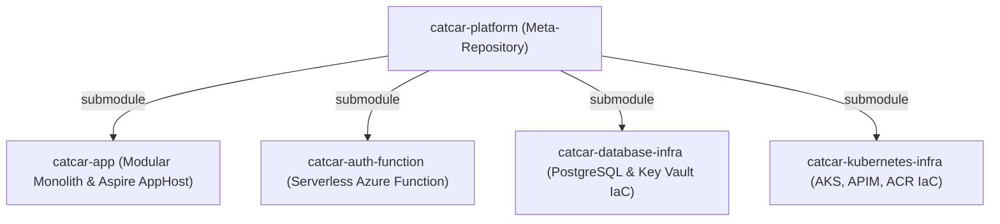

# Repository Guidelines

## Project Overview
`catcar-platform` is the umbrella meta-repository coordinating the backend platform for **CatCar**, an automotive repair shop management system (*oficina mecânica*). The platform manages the entire lifecycle of repair shop operations:
- **Customer & Vehicle Intake**: Customer identification via Brazilian taxpayer documents (CPF/CNPJ with check-digit validation) and vehicle records with Mercosul/legacy license plate formatting.
- **Work Orders (*Ordem de Serviço - OS*)**: Lifecycle state machine (`Received` -> `InDiagnosis` -> `AwaitingApproval` -> `InExecution` -> `Completed` -> `Delivered`).
- **Diagnostics & Budgets**: Diagnostic line items, commercial proposals with immutable price snapshots, and customer approval/rejection workflows.
- **Catalog & Inventory**: Service catalog, spare parts catalog, stock level tracking, automated inventory reservations upon budget approval, and stock consumption upon completion.
- **Customer Communication**: Single-use cryptographic approval links with TTL expiration and automated transactional status emails.
- **Identity & Security**: Administrative JWT authentication with Argon2id password hashing for backoffice staff, and serverless CPF/CNPJ authentication for customers.

---

## Architecture & Data Flow

### Umbrella Meta-Repository Topology
The platform is organized as four synchronized Git submodules/repositories:



1. **`catcar-app`**: .NET 10 Modular Monolith containing all core business domains, Vertical Slice Architecture, EF Core persistence, Wolverine messaging, and .NET Aspire AppHost orchestration.
2. **`catcar-auth-function`**: Serverless Azure Functions Isolated Worker (.NET 10) providing customer CPF authentication and JWT issuance with read-only database access.
3. **`catcar-database-infra`**: Terraform configuration provisioning Azure Database for PostgreSQL Flexible Server 17, Azure Key Vault, Private DNS zones, and Private Endpoints.
4. **`catcar-kubernetes-infra`**: Terraform configuration provisioning Azure Virtual Network, AKS cluster, Azure API Management (APIM), Azure Container Registry (ACR), and Azure Monitor alerting.

### Bounded Contexts & Database Isolation (`catcar-app`)
`catcar-app` strictly enforces Domain-Driven Design (DDD) with four autonomous Bounded Contexts:

| Bounded Context | Type | Responsibilities & Aggregates | PostgreSQL Schema |
| :--- | :--- | :--- | :--- |
| **`ServiceOperations`** | Core | `WorkOrder`, `Budget`, `Customer`, `Vehicle` | `service_operations` |
| **`CatalogInventory`** | Supporting | `CatalogedService`, `InventoryItem`, `InventoryReservation` | `catalog_inventory` |
| **`Communication`** | Supporting | `ExternalAccessToken`, email notification dispatchers | `communication` |
| **`IdentityAccess`** | Generic | `AdministrativeUser`, roles, Argon2id hashing, admin JWT | `identity_access` |

### Architectural Invariants & NetArchTest Rules
- **Context Isolation**: No Bounded Context may reference another context's assembly or namespace.
- **Layer Direction**: Domain entities and Vertical Slice Features must never reference `Microsoft.EntityFrameworkCore` or infrastructure types.
- **SharedKernel Purity**: `src/SharedKernel` contains only tactical DDD primitives (`Entity<TId>`, `ValueObject`, `IAggregateRoot`, `IDomainEvent`, `IIntegrationEvent`, `BusinessRuleViolatedException`) with zero business logic or external library dependencies.
- **Vertical Slice Structure**: Each context must strictly follow `Domain/`, `Features/<UseCase>/`, `Infrastructure/`, and optional `Integrations/` folder layouts.

### Data Flow & Integration Patterns
1. **Asynchronous Cross-Context Integration (Transactional Outbox)**:
   - Aggregates record domain events and publish `IIntegrationEvent` contracts from `src/Contracts`.
   - Events are written to the Wolverine PostgreSQL transactional outbox within the same database transaction via `IDbContextOutbox<TDbContext>.PublishAsync(...)`.
   - Wolverine's durable outbox background dispatcher relays events to consumers asynchronously.
   - *Example*: `BudgetApprovedIntegrationEvent` (from `ServiceOperations`) is consumed by `BudgetApprovedHandler` in `CatalogInventory` to reserve stock items.
2. **Synchronous In-Process Queries (Anti-Corruption Layer - ACL)**:
   - When one context needs read-only data from another, direct database queries across schemas are forbidden.
   - The consumer calls an ACL interface (e.g., `ICatalogInventoryAcl`) that dispatches an in-process query via `IMessageBus.InvokeAsync<TResponse>(query)`.
   - The ACL maps the contract DTO response into local domain value objects.
3. **Optimistic Concurrency & Auditing**:
   - Entities map PostgreSQL's native `xmin` system column as a row version token (`.HasColumnType("xid").IsRowVersion()`).
   - `AuditInterceptor` automatically populates `created_at`, `updated_at`, `created_by`, and `updated_by` shadow properties on `SaveChanges`.
   - Entity IDs use time-ordered UUID v7 (`Guid.CreateVersion7()`).

---

## Key Directories

```
catcar-platform/
├── Makefile                                # Platform CLI orchestrator (dev, build, test, format, infra-validate, git-sync)
├── catcar.code-workspace                   # Multi-root workspace configuration (VS Code / Cursor / Windsurf)
├── scripts/                                # Local dev and Azure cloud bootstrap automation
│   ├── kind-with-registry.sh               # Provisions local Kind Kubernetes cluster + local registry on :5001
│   └── bootstrap-azure.sh                  # Azure & GitHub Actions control-plane bootstrap runbook automation
├── docs/                                   # Architectural RFCs, ADRs, DDD strategic design, and cloud topology docs
│   ├── azure-bootstrap.md                  # Runbook for bootstrap-azure.sh and Entra OIDC setup
│   ├── vulnerability-report.md             # Security audit report (SCA, SAST, Trivy, SonarQube)
│   ├── requirements/                       # Tech Challenge specifications (Fase 1-4)
│   ├── ddd/                                # Domain-Driven Design artifacts (context map, module structure, glossary)
│   └── architecture/                       # Cloud topology, ER model, auth sequences, ADRs, and RFCs
├── catcar-app/                             # Modular Monolith and Aspire AppHost
│   ├── CatCar.slnx                         # Solution manifest (XML-based slnx format)
│   ├── Directory.Build.props               # Solution-wide MSBuild compiler flags and analyzers
│   ├── Directory.Packages.props            # Central Package Management (CPM) versions
│   ├── src/
│   │   ├── SharedKernel/                   # Tactical DDD building blocks (Entity, ValueObject, Domain Events)
│   │   ├── SharedInfrastructure/           # Reusable EF Core naming conventions (SnakeCaseNaming)
│   │   ├── Contracts/                      # Published Language cross-context integration events & DTOs
│   │   ├── Contexts/
│   │   │   ├── ServiceOperations/          # Core Domain: Work Orders, Budgets, Customers, Vehicles
│   │   │   ├── CatalogInventory/           # Supporting Domain: Cataloged Services, Parts Inventory, Reservations
│   │   │   ├── Communication/              # Supporting Domain: Single-use approval tokens, Email dispatchers
│   │   │   └── IdentityAccess/             # Generic Domain: Backoffice users, roles, Argon2id, Admin JWT
│   │   ├── Api/                            # Composition Root: Minimal APIs, Wolverine routing, Scalar docs
│   │   └── Host/
│   │       ├── CatCar.AppHost/             # .NET Aspire AppHost (local orchestration & Kubernetes generation)
│   │       └── CatCar.ServiceDefaults/     # OpenTelemetry, Health checks, and Resilience defaults
│   └── tests/
│       ├── Architecture.Tests/             # NetArchTest architectural boundary fitness functions
│       ├── SharedKernel.Tests/             # Unit tests for DDD base classes and value objects
│       ├── Contexts.*/                     # Vertical slice unit & PostgreSQL Testcontainers integration tests
│       └── E2E/                            # Aspire.Hosting.Testing end-to-end integration tests
├── catcar-auth-function/                   # Serverless Customer Authentication (.NET 10 Isolated Worker)
│   ├── CatCar.AuthFunction.slnx            # Solution manifest
│   ├── src/CatCar.AuthFunction/            # Customer CPF/CNPJ verification and JWT issuance
│   └── tests/CatCar.AuthFunction.Tests/    # Function unit & validation tests
├── catcar-database-infra/                  # Terraform IaC for PostgreSQL 17 Flexible Server & Key Vault
└── catcar-kubernetes-infra/                # Terraform IaC for AKS, APIM, ACR, VNet, and Azure Monitor Alerts
```

---

## Development Commands

### Platform-Level Commands (Root `Makefile`)
```bash
# Display help and all available Makefile targets
make help

# Restore all NuGet packages across all .NET solutions
make restore

# Build all .NET solutions (modular monolith and auth function)
make build

# Run all test suites across all solutions
make test

# Start the complete local development topology via .NET Aspire
make dev

# Auto-format all C# code and Terraform configurations
make format

# Validate all Terraform configurations without backend initialization
make infra-validate

# Check Git status across parent repo and all submodules
make git-status

# Synchronize repo and recursively update submodules
make git-sync
```

### Local Environment & Cloud Setup Scripts (`scripts/`)
```bash
# Provision local Kind Kubernetes cluster with local Docker registry (localhost:5001)
./scripts/kind-with-registry.sh

# Run Azure control-plane bootstrap (Resource Groups, Storage, Entra OIDC Apps, RBAC, GitHub secrets)
./scripts/bootstrap-azure.sh
```

### Build & Run Commands
```bash
# Build catcar-app in Release mode (treats warnings as errors)
dotnet build catcar-app/CatCar.slnx -c Release

# Build catcar-auth-function
dotnet build catcar-auth-function/CatCar.AuthFunction.slnx -c Release

# Start Aspire AppHost via .NET CLI
dotnet run --project catcar-app/src/Host/CatCar.AppHost/CatCar.AppHost.csproj

# Alternatively manage Aspire via aspire CLI tool
dotnet tool run aspire -- start --apphost catcar-app/src/Host/CatCar.AppHost/CatCar.AppHost.csproj --environment Development
dotnet tool run aspire -- wait api --status healthy --apphost catcar-app/src/Host/CatCar.AppHost/CatCar.AppHost.csproj
dotnet tool run aspire -- stop --apphost catcar-app/src/Host/CatCar.AppHost/CatCar.AppHost.csproj

# Run database migrations against target database
dotnet run --project catcar-app/src/Api/CatCar.Api.csproj -- --migrate

# Run via Docker Compose (PostgreSQL on 5432, API on 8080)
docker compose -f catcar-app/docker-compose.yml up -d
```

### Formatting, Linting & Validation
```bash
# Check C# whitespace formatting without modifying files (CI check)
dotnet format whitespace catcar-app/CatCar.slnx --verify-no-changes --no-restore
dotnet format whitespace catcar-auth-function/CatCar.AuthFunction.slnx --verify-no-changes --no-restore

# Fix C# formatting
dotnet format catcar-app/CatCar.slnx
dotnet format catcar-auth-function/CatCar.AuthFunction.slnx

# Format and validate Terraform files
terraform -chdir=catcar-database-infra fmt -check -recursive
terraform -chdir=catcar-database-infra validate
terraform -chdir=catcar-kubernetes-infra fmt -check -recursive
terraform -chdir=catcar-kubernetes-infra validate
terraform -chdir=catcar-kubernetes-infra/alerts validate
```

---

## Code Conventions & Common Patterns

### Language & Ubiquitous Language Naming
- **Strict English**: All identifiers, types, methods, comments, logs, and test names must be written in English.
- **Domain Translations**: Brazilian automotive repair terms are mapped to standard English types:
  - *Ordem de Serviço (OS)* -> `WorkOrder`
  - *Orçamento* -> `Budget`
  - *Cliente* -> `Customer`
  - *Veículo / Placa* -> `Vehicle` / `LicensePlate`
  - *Peça / Estoque* -> `InventoryItem` / `InventoryReservation`
  - *Serviço de Catálogo* -> `CatalogedService`
  - *Usuário Administrativo* -> `AdministrativeUser`

### Vertical Slice File Organization
Features must be organized in self-contained vertical slice folders:
```
Features/WorkOrders/OpenWorkOrder/
├── OpenWorkOrderCommand.cs          # Input record implementing IRequest<Upshot<OpenWorkOrderResult>>
├── OpenWorkOrderCommandValidator.cs # FluentValidation AbstractValidator<OpenWorkOrderCommand>
├── OpenWorkOrderHandler.cs          # Static Wolverine handler class
├── OpenWorkOrderEndpoint.cs         # Minimal API endpoint mapping with TypedResults
└── OpenWorkOrderResult.cs           # Output response record
```

### Error Handling & Result Rail Pattern
- **`Upshot<T>` Result Type**: Feature handlers and domain operations return `Upshot` or `Upshot<T>` from `RiseOn.ResultRail`.
- **No Control-Flow Exceptions**: Routine validation failures, missing records, and invalid state transitions return `Upshot.Fail("Error message")`.
- **Domain Invariants**: `BusinessRuleViolatedException` (from `SharedKernel`) is thrown only when an internal entity invariant is corrupted unexpectedly.
- **HTTP Problem Details**: Minimal API endpoints match on `Upshot`:
  ```csharp
  result.Match(
      onSuccess: value => Results.Ok(value),
      onFailure: error => Results.Problem(
          title: "Bad Request",
          detail: error.Message,
          statusCode: StatusCodes.Status400BadRequest));
  ```

### Dependency Injection & Service Registration
- **Automatic Registration**: Repositories, domain services, and infrastructure adapters use `[InjectService]` from `RiseOn.AutoInject`:
  ```csharp
  [InjectService(ServiceLifetimeType.Scoped, CollectionName = "ServiceOperations")]
  public class WorkOrderRepository : IWorkOrderRepository { ... }
  ```
- **Context Composition**: Each Bounded Context exposes an `IServiceCollection` extension method (`AddServiceOperations`, `AddCatalogInventory`, etc.) registering its DbContext, FluentValidation validators, and auto-injected services.
- **Static Wolverine Handlers**: Feature handlers are static classes with static `Handle(...)` methods where dependencies are resolved directly via method parameters.

### Async Patterns & Logging
- **Asynchronous Execution**: All I/O methods must accept a `CancellationToken` and append `.ConfigureAwait(false)` in library and infrastructure code.
- **Zero-Allocation Structured Logging**: Use source-generated `[LoggerMessage]` partial methods:
  ```csharp
  [LoggerMessage(EventId = 101, Level = LogLevel.Information, Message = "Work order {WorkOrderId} opened for customer {CustomerId}")]
  public static partial void LogWorkOrderOpened(ILogger logger, Guid workOrderId, Guid customerId);
  ```

---

## Important Files

| File Path | Role & Purpose |
| :--- | :--- |
| `Makefile` | Root CLI interface defining standard developer targets (`dev`, `build`, `test`, `format`, `infra-validate`, `git-sync`). |
| `README.md` | Platform documentation covering topology, cloud architecture, Aspire runtime, scripts, docs index, and submodules. |
| `scripts/kind-with-registry.sh` | Shell script provisioning local Kind Kubernetes cluster with embedded Docker registry on port 5001. |
| `scripts/bootstrap-azure.sh` | Shell script automating Azure Resource Groups, Storage, Entra OIDC Apps, RBAC, and GitHub Secrets. |
| `docs/azure-bootstrap.md` | Runbook and governance guide for Azure and GitHub control-plane bootstrap. |
| `docs/vulnerability-report.md` | Software quality and security audit report covering SCA, SAST, Trivy, and SonarQube gates. |
| `docs/architecture/adr/` | Architecture Decision Records (Outbox 001, HPA/APIM 002, Submodule Topology 003). |
| `docs/architecture/rfc/` | RFC proposals (Cloud Provider 001, PostgreSQL 002, Serverless Auth 003). |
| `docs/ddd/` | Domain-Driven Design artifacts (context map, module structure, ubiquitous language glossary). |
| `catcar-app/CatCar.slnx` | Primary solution manifest organizing the modular monolith into 15 projects. |
| `catcar-app/Directory.Packages.props` | Central Package Management (CPM) manifest pinning all NuGet versions and security overrides. |
| `catcar-app/Directory.Build.props` | Root MSBuild settings (`net10.0`, `Nullable=enable`, `TreatWarningsAsErrors=true`, `AnalysisMode=All`). |
| `catcar-app/.editorconfig` | Code style configuration enforcing 4 spaces, LF, max line 160 chars, and file-scoped namespaces. |
| `catcar-app/src/Api/Program.cs` | Modular monolith composition root: registers Serilog, Wolverine outbox/bus, Swagger/Scalar docs, and maps endpoint route groups. |
| `catcar-app/src/Host/CatCar.AppHost/AppHost.cs` | Dual-mode .NET Aspire AppHost orchestrating PostgreSQL, Azurite, CatCar.Api, and CatCar.AuthFunction. |
| `catcar-app/src/Host/CatCar.AppHost/KubernetesPublishingExtensions.cs` | Production workload hardening: non-root execution, dropped capabilities, probes, and HPA autoscaling (2–10 replicas). |
| `catcar-app/src/Host/CatCar.ServiceDefaults/Extensions.cs` | Shared host extensions for OpenTelemetry tracing/metrics, health endpoints (`/health/live`, `/health/ready`), and resilience. |
| `catcar-app/src/SharedKernel/Entity.cs` | Tactical DDD base primitives (`Entity<TId>`, `ValueObject`, `IAggregateRoot`, `IDomainEvent`, `IIntegrationEvent`). |
| `catcar-app/src/Contracts/CatCar.Contracts.csproj` | Published Language event contracts published across context boundaries via Wolverine outbox. |
| `catcar-app/src/Contexts/ServiceOperations/Domain/WorkOrders/WorkOrder.cs` | Central repair order aggregate root governing status transitions, budget assignments, and execution milestones. |
| `catcar-app/src/Contexts/ServiceOperations/Infrastructure/ServiceOperationsDbContext.cs` | Core DbContext mapping `service_operations` schema, `xmin` optimistic concurrency, and audit interceptors. |
| `catcar-auth-function/src/CatCar.AuthFunction/Program.cs` | Serverless customer CPF authentication function worker entry point. |
| `catcar-database-infra/main.tf` | Terraform root module for PostgreSQL 17 Flexible Server, Key Vault, and Private Endpoints. |
| `catcar-kubernetes-infra/main.tf` | Terraform root module for AKS cluster, Azure API Management (APIM), ACR, and VNet. |

---

## Runtime/Tooling Preferences

- **Runtime & SDK**: **.NET 10 LTS (`net10.0`)**, C# 14.
- **Serverless**: **Azure Functions Isolated Worker v4** (.NET 10) on Azure Functions Core Tools `v4.14.0+`.
- **Database**: **PostgreSQL 17.x** (local container: `postgres:17-alpine`; cloud: Azure Database for PostgreSQL Flexible Server).
- **Package Management**: **NuGet Central Package Management (CPM)**.
  - `<ManagePackageVersionsCentrally>true</ManagePackageVersionsCentrally>` is enforced.
  - **Rule**: NEVER specify `Version="..."` in individual `.csproj` files; declare all versions in `Directory.Packages.props`.
- **No Node.js / Python / Rust**: There are no `package.json`, `pyproject.toml`, or `Cargo.toml` files in the repository. The backend is 100% .NET 10 C# and HashiCorp Terraform (`>= 1.5.0`).
- **Compiler Flags & Strict Quality Constraints**:
  - `<TreatWarningsAsErrors>true</TreatWarningsAsErrors>`: All C# compiler warnings break the build.
  - `<Nullable>enable</Nullable>`: Nullable reference types are strictly enforced.
  - `<AnalysisMode>All</AnalysisMode>`: Highest Roslyn code analysis enforcement.
- **Local .NET Tools (`catcar-app/dotnet-tools.json`)**:
  - `dotnet-ef` (`10.0.12`): EF Core database migrations.
  - `dotnet-sonarscanner` (`11.3.0`): SonarQube Cloud quality analysis.
  - `aspire.cli` (`13.5.4`): .NET Aspire orchestration and manifest generation.

---

## Testing & QA

### Test Frameworks & Libraries
- **Unit / Feature Testing**: `xUnit` (`2.9.3`) with `[Fact]` and `[Theory]`.
- **Assertions**: `FluentAssertions` (`8.11.0` - pinned to v8.x for Apache-2.0 license compatibility).
- **Mocking**: `NSubstitute` (`6.2.0`) for test doubles (`Substitute.For<T>()`).
- **Integration Testing**: `Testcontainers.PostgreSql` (`4.15.0`) spinning up ephemeral `postgres:17-alpine` Docker containers to test real PostgreSQL schemas, `xmin` concurrency, and Wolverine outbox tables.
- **Architecture Enforcement**: `NetArchTest.Rules` (`1.3.2`) enforcing DDD boundaries, cross-context isolation, and layer direction.
- **End-to-End Orchestration**: `Aspire.Hosting.Testing` (`13.5.4`) running the complete multi-resource AppHost in-process.
- **Fake Data Generation**: `Bogus` (`35.6.5`).
- **Code Coverage**: `coverlet.collector` (`10.0.1`).

### Running Tests
```bash
# Run all 343+ tests across all solutions
make test

# Run tests in Release mode without rebuild
dotnet test catcar-app/CatCar.slnx --no-build -c Release

# Run tests with OpenCover coverage collection (matches CI)
dotnet test catcar-app/CatCar.slnx --no-build -c Release \
  --collect:"XPlat Code Coverage" \
  --results-directory ./TestResults/Coverage \
  --logger "trx;LogFileName=all-tests.trx" \
  -- DataCollectionRunSettings.DataCollectors.DataCollector.Configuration.Format=opencover

# Filter test execution by slice or layer
dotnet test catcar-app/CatCar.slnx -c Release --filter "FullyQualifiedName~Architecture"
dotnet test catcar-app/CatCar.slnx -c Release --filter "FullyQualifiedName~SharedKernel"
dotnet test catcar-app/CatCar.slnx -c Release --filter "FullyQualifiedName~ServiceOperations"
dotnet test catcar-app/CatCar.slnx -c Release --filter "FullyQualifiedName~E2E"

# Run customer auth function tests
dotnet test catcar-auth-function/CatCar.AuthFunction.slnx -c Release
```

### Test Naming Convention
Test methods must adhere to the `MethodName_StateUnderTest_ExpectedBehavior` pattern (CA1707 is suppressed in test projects):
```csharp
[Fact]
public async Task Handle_WithValidCommand_ShouldCreateWorkOrderAndPublishOutboxEvent()
{
    // Arrange
    ...
    // Act
    ...
    // Assert
    ...
}
```

### Quality & Coverage Expectations
- **Coverage Expectation**: Minimum **80% line and branch coverage** on core business domain logic (`SharedKernel`, `Contexts.ServiceOperations`, `Contexts.CatalogInventory`).
- **Automated CI Quality Gates**:
  1. **Formatting**: `dotnet format whitespace --verify-no-changes`.
  2. **Test Suite**: 100% pass rate across unit, architecture, integration, and E2E tests.
  3. **Opengrep SAST**: Zero findings with severity `ERROR` (`p/csharp`, `p/security-audit`).
  4. **NuGet SCA**: Zero `Critical` or `High` vulnerable packages.
  5. **Trivy Container Scan**: Zero `CRITICAL` or `HIGH` container vulnerabilities.
  6. **SonarQube Cloud**: Clean Quality Gate passing on project `daviholandas_RiseOn.CatCar`.
