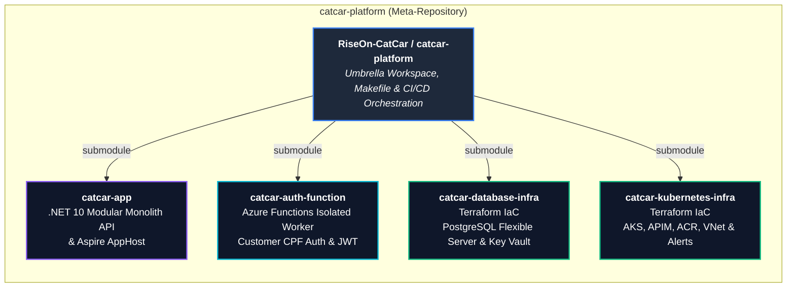
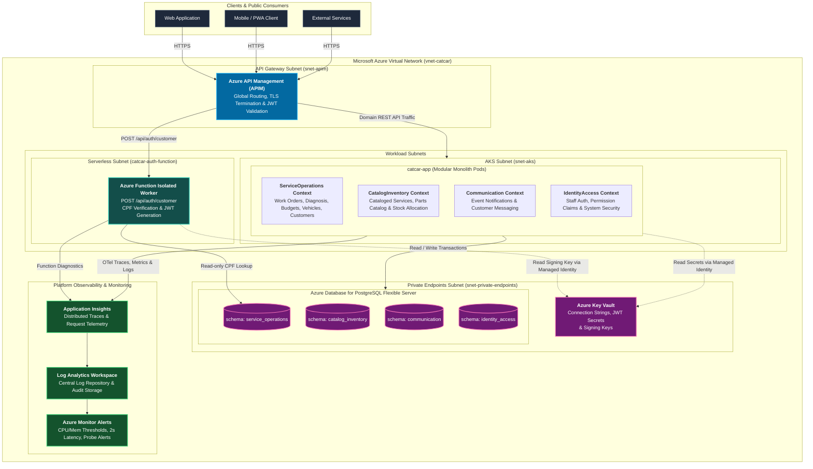
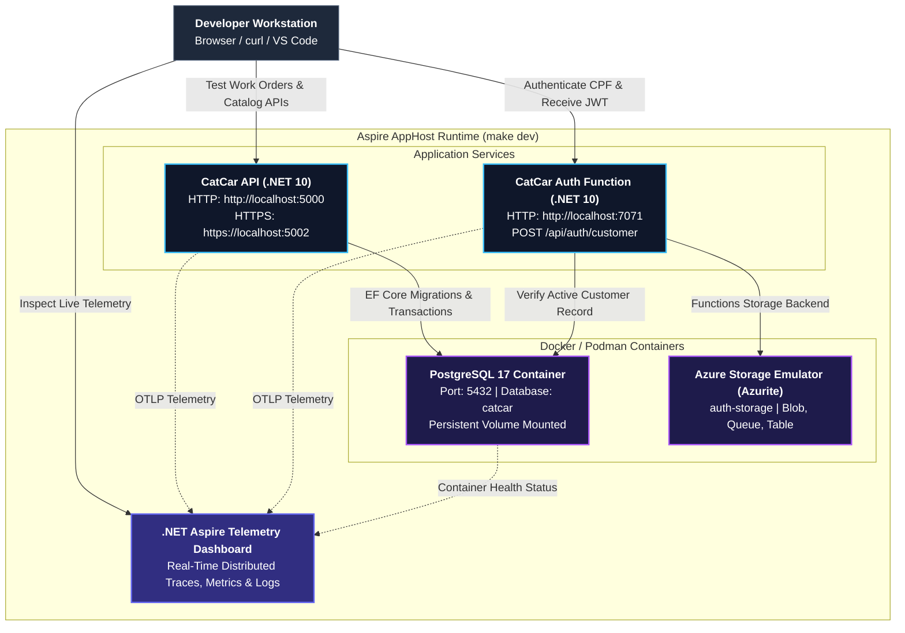

# CatCar Platform

[](https://github.com/RiseOn-CatCar)
[](https://dotnet.microsoft.com/)
[](https://learn.microsoft.com/dotnet/csharp/)
[](https://learn.microsoft.com/dotnet/aspire/)
[](https://www.terraform.io/)
[](https://azure.microsoft.com/)
[](https://kubernetes.io/)

> **The umbrella meta-repository and engineering workspace for the CatCar car repair shop management platform under the [`RiseOn-CatCar`](https://github.com/RiseOn-CatCar) organization.**

`catcar-platform` coordinates the distributed components, backend applications, serverless functions, and infrastructure stacks that power CatCar. By pinning each independent component as a Git submodule, this repository guarantees reproducible, known-compatible platform builds across local development, testing, and production cloud environments.

---

## Table of Contents

- [Repository Topology](#repository-topology)
- [System Architecture & Cloud Topology](#system-architecture--cloud-topology)
- [Local Development Runtime with .NET Aspire](#local-development-runtime-with-net-aspire)
- [Quick Start Guide](#quick-start-guide)
- [Makefile Developer Commands](#makefile-developer-commands)
- [Automation Scripts](#automation-scripts)
- [Project Documentation & Architecture Records](#project-documentation--architecture-records)
- [Submodule Workflow & Contribution Guide](#submodule-workflow--contribution-guide)
- [Platform Technology Stack](#platform-technology-stack)
---

## Repository Topology

The CatCar platform decouples application domains, serverless identity services, and cloud infrastructure into specialized, independently versioned repositories under the [`RiseOn-CatCar`](https://github.com/RiseOn-CatCar) GitHub organization:



### Component Breakdown

```
+-------------------------------------------------------------------------------------------------------------------+
|                                          RiseOn-CatCar / catcar-platform                                          |
|                                            (Umbrella Meta-Repository)                                             |
+---------------------------+-----------------------------------+---------------------------------------------------+
| Component Submodule       | Role & Architectural Scope        | Remote Repository Link                            |
+---------------------------+-----------------------------------+---------------------------------------------------+
| catcar-app                | Backend Modular Monolith API,     | https://github.com/RiseOn-CatCar/catcar-app       |
|                           | Domain Contexts, EF Core, Wolverine|                                                   |
|                           | Outbox, and .NET Aspire AppHost   |                                                   |
| catcar-auth-function      | Serverless Azure Function (.NET   | https://github.com/RiseOn-CatCar/catcar-auth-function|
|                           | 10 Isolated) for customer CPF     |                                                   |
|                           | validation & JWT token issuance   |                                                   |
| catcar-database-infra     | Terraform IaC provisioning Azure  | https://github.com/RiseOn-CatCar/catcar-database-infra|
|                           | Database for PostgreSQL Flexible  |                                                   |
|                           | Server, Key Vault & Private DNS   |                                                   |
| catcar-kubernetes-infra   | Terraform IaC provisioning Azure  | https://github.com/RiseOn-CatCar/catcar-kubernetes-infra|
|                           | Virtual Network, AKS Cluster,     |                                                   |
|                           | API Management (APIM), ACR & OTel |                                                   |
+---------------------------+-----------------------------------+---------------------------------------------------+
```

---

## System Architecture & Cloud Topology

In cloud environments (Homologation and Production), external traffic passes through an Azure API Management gateway that secures, inspects, and routes requests to the appropriate compute layer. The modular monolith executes inside Azure Kubernetes Service (AKS), while customer authentication is handled serverlessly via Azure Functions.



### Architectural Highlights

- **Bounded Context Isolation**: Each Domain Context within `catcar-app` operates against its own schema in PostgreSQL (`service_operations`, `catalog_inventory`, `communication`, `identity_access`), preventing tight coupling at the data layer.
- **Outbox Pattern & In-Process Messaging**: Wolverine orchestrates domain events and reliable asynchronous integration using the PostgreSQL transactional outbox.
- **Zero-Trust Networking**: All database and Key Vault communications route exclusively over Azure Private Endpoints (`snet-private-endpoints`) with private DNS resolution. No database ports are exposed publicly.
- **Centralized Observability**: OpenTelemetry standardizes traces, metrics, and structured logs across AKS pods and Azure Functions into Application Insights and Log Analytics.

---

## Local Development Runtime with .NET Aspire

Local platform execution is orchestrated through [.NET Aspire](https://learn.microsoft.com/dotnet/aspire/) via `catcar-app/src/Host/CatCar.AppHost/CatCar.AppHost.csproj`. A single command spins up the backend API, the serverless authentication function, a dedicated PostgreSQL database container with volume persistence, the Azurite storage emulator, and the interactive Aspire Telemetry Dashboard.



### Local Runtime Topology (ASCII)

```
+----------------------------------------------------------------------------------------------------+
|                                    .NET Aspire Orchestration                                       |
|                               (CatCar.AppHost via `make dev`)                                      |
+----------------------------------------------------------------------------------------------------+
|                                                                                                    |
|   +---------------------------------+                         +--------------------------------+   |
|   |    Aspire Telemetry Dashboard   | <--- OTLP Telemetry --- |    CatCar.Api                  |   |
|   |    (Live Traces, Metrics, Logs) | <--- OTLP Telemetry --- |    http://localhost:5000       |   |
|   +---------------------------------+                         |    https://localhost:5002      |   |
|                                                               +---------------+----------------+   |
|                                                                               |                    |
|                                                                               | EF Core Read/Write |
|   +---------------------------------+                                         v                    |
|   |    CatCar.AuthFunction          | ----------------------------------> +--------------------+   |
|   |    http://localhost:7071        |        Read-Only Query (CPF)        |    PostgreSQL 17   |   |
|   |    POST /api/auth/customer      |                                     |    Port: 5432      |   |
|   +----------------+----------------+                                     |    db: catcar      |   |
|                    |                                                      +--------------------+   |
|                    | Functions Host Storage                                                        |
|                    v                                                                               |
|   +---------------------------------+                                                              |
|   |    Azurite Storage Emulator     |                                                              |
|   |    (auth-storage container)     |                                                              |
|   +---------------------------------+                                                              |
+----------------------------------------------------------------------------------------------------+
```

---

## Quick Start Guide

### Prerequisites

Ensure the following tools are installed on your workstation:

- [.NET 10 SDK](https://dotnet.microsoft.com/download/dotnet/10.0)
- [Docker](https://www.docker.com/) or [Podman](https://podman.io/) (for local database and storage containers)
- [Terraform](https://www.terraform.io/) (`>= 1.5.0`)
- [GNU Make](https://www.gnu.org/software/make/) (`>= 4.0`)
- [Azure Functions Core Tools](https://learn.microsoft.com/azure/azure-functions/functions-run-local) (`v4.14.0+`, required for isolated function execution)

### 1. Clone the Platform

Clone the platform repository with the `--recurse-submodules` flag to automatically fetch all pinned submodule revisions:

```bash
git clone --recurse-submodules https://github.com/RiseOn-CatCar/catcar-platform.git
cd catcar-platform
```

If you already cloned without submodules, initialize and populate them with:

```bash
git submodule update --init --recursive
```

### 2. Multi-Repository Workspace Configuration

Open the unified workspace in your preferred IDE:

```bash
# Visual Studio Code
code catcar.code-workspace

# Cursor
cursor catcar.code-workspace

# Windsurf
windsurf catcar.code-workspace
```

For **JetBrains Rider**, open the root `catcar-platform` directory or open `catcar-app/CatCar.slnx` and attach `catcar-auth-function/CatCar.AuthFunction.slnx`.

`catcar.code-workspace` automatically configures:
- Multi-root project navigation for all four repositories.
- Default .NET solution set to `catcar-app/CatCar.slnx`.
- Automatic C# format-on-save rules.
- Terraform Language Server integration and formatting settings.

### 3. Build & Run Locally

```bash
# 1. Restore all dependencies across application and function solutions
make restore

# 2. Launch the full local topology (API + Auth Function + PostgreSQL + Aspire Dashboard)
make dev
```

Once started, the terminal displays the Aspire Dashboard URL (typically `http://localhost:18888` or a dynamic port). Open it in your browser to inspect live resource health, logs, and distributed traces.

---

## Makefile Developer Commands

The platform includes a standardized GNU `Makefile` configured with strict shell safety flags (`bash -eu -o pipefail -c`). All tasks can be discovered with `make` or `make help`.

| Target | Description | Executed Actions |
| :--- | :--- | :--- |
| `make help` | Displays the command menu and target descriptions | Formatted catalog output (default goal) |
| `make restore` | Restores dependencies for all .NET solutions | `dotnet restore` on `catcar-app` and `catcar-auth-function` |
| `make build` | Compiles application and function solutions | `dotnet build` on `catcar-app/CatCar.slnx` and `catcar-auth-function/CatCar.AuthFunction.slnx` |
| `make test` | Runs unit and integration test suites | `dotnet test` on `catcar-app/CatCar.slnx` and `catcar-auth-function/CatCar.AuthFunction.slnx` |
| `make dev` | Launches local platform via Aspire AppHost | `dotnet run --project catcar-app/src/Host/CatCar.AppHost/CatCar.AppHost.csproj` |
| `make format` | Formats C# code and Terraform configurations | `dotnet format` on both solutions and `terraform fmt -recursive` on both infra modules |
| `make infra-validate` | Validates database, Kubernetes, and alert Terraform stacks | `terraform init -backend=false` and `terraform validate` across infra modules |
| `make git-status` | Displays short branch status and submodule commit SHAs | `git status --short --branch` and `git submodule status` |
| `make git-sync` | Rebase-pulls platform and syncs submodules to remote heads | `git pull --rebase` and `git submodule update --remote --merge` |

---

## Automation Scripts

The platform provides standardized shell scripts located in [`scripts/`](scripts/) for local environment setup and cloud control-plane initialization:

| Script Path | Purpose | Description |
| :--- | :--- | :--- |
| [`scripts/kind-with-registry.sh`](scripts/kind-with-registry.sh) | Local Kubernetes Cluster | Creates a local multi-node [Kind](https://kind.sigs.k8s.io/) cluster with an integrated Docker container registry on `localhost:5001`. |
| [`scripts/bootstrap-azure.sh`](scripts/bootstrap-azure.sh) | Azure & GitHub Bootstrap | Establishes the Azure foundation (Resource Groups, Storage Account, Microsoft Entra OIDC Apps, RBAC) and GitHub Actions environments/secrets without provisioning application workloads. |

For detailed usage instructions and governance requirements for Azure bootstrap, refer to the [Azure Bootstrap Guide](docs/azure-bootstrap.md).

---

## Project Documentation & Architecture Records

All architectural decisions, Domain-Driven Design artifacts, RFC proposals, security audits, and phase requirements are documented in [`docs/`](docs/):

### Architecture Decision Records (ADRs)
- [ADR 001: Asynchronous Cross-Context Communication with a Transactional Outbox](docs/architecture/adr/001-asynchronous-communication-outbox.md)
- [ADR 002: HPA Workload Scaling and APIM Rate Limiting](docs/architecture/adr/002-hpa-and-apim-scaling.md)
- [ADR 003: Multi-Repository Topology and Aspire Submodule Composition](docs/architecture/adr/003-repository-topology.md)

### Requests for Comments (RFCs)
- [RFC 001: Cloud Provider Selection (Microsoft Azure)](docs/architecture/rfc/001-cloud-provider-selection.md)
- [RFC 002: Managed Database Engine Selection (PostgreSQL 17)](docs/architecture/rfc/002-managed-database.md)
- [RFC 003: Serverless Customer Authentication with Azure Functions](docs/architecture/rfc/003-serverless-auth.md)

### Domain-Driven Design (DDD) Artifacts
- [DDD Overview & Strategic Design](docs/ddd/README.md)
- [Strategic Context Map](docs/ddd/context-map.md)
- [Module Structure & Solution Organization](docs/ddd/module-structure.md)
- [Event Storming Domain Flows](docs/ddd/event-storming.md)
- [Ubiquitous Language Glossary](docs/ddd/glossary.md)

### Operations, Security & Requirements
- [Azure Control-Plane Bootstrap Runbook](docs/azure-bootstrap.md)
- [Phase 1/2 Vulnerability & Security Report](docs/vulnerability-report.md)
- [Cloud Components & Topology Specification](docs/architecture/cloud-components.md)
- [Authentication & Work Order Sequence Diagrams](docs/architecture/auth-sequence.md)
- [Entity-Relationship (ER) Model](docs/architecture/er-model.md)
- [Tech Challenge Phase Requirements (Fase 1-4)](docs/requirements/)
---

## Submodule Workflow & Contribution Guide

`catcar-platform` uses Git submodules to maintain strict version pinning across repositories. Each submodule references a specific commit hash (gitlink) in its target repository. Follow these workflows when contributing.

### Workflow A: Developing Changes in a Sub-Repository

Always perform code changes, commit, and push directly within the specific submodule directory:

```bash
# 1. Navigate to the submodule
cd catcar-app

# 2. Create and switch to your feature branch
git checkout -b feature/work-order-lifecycle

# 3. Implement changes, test locally
dotnet test

# 4. Commit and push to the component repository
git commit -am "feat(service-ops): add work order lifecycle events"
git push -u origin feature/work-order-lifecycle

# 5. Open and merge a Pull Request in RiseOn-CatCar/catcar-app
```

### Workflow B: Updating the Submodule Pointer in the Platform

Once the changes are merged upstream in the submodule repository, update the platform pointer so team members and CI pipelines pick up the latest revision:

```bash
# 1. From the platform root, navigate to the submodule and pull latest main
cd /home/davi_/Projects/CatCar/catcar-app
git checkout main
git pull origin main

# 2. Return to the platform root
cd /home/davi_/Projects/CatCar

# 3. Check status (git detects the updated submodule commit SHA)
git status
# modified:   catcar-app (new commits)

# 4. Stage, commit, and push the updated gitlink
git add catcar-app
git commit -m "chore: bump catcar-app submodule pointer to latest main"
git push origin main
```

### Workflow C: Synchronizing All Submodules to Latest Remote Heads

To advance all four submodules to their latest tracked remote branches in one step:

```bash
make git-sync
```

Or manually:

```bash
git pull --rebase
git submodule update --init --recursive
git submodule update --remote --merge
git commit -am "chore: update platform component pointers"
git push origin main
```

---

## Platform Technology Stack

| Layer | Technologies & Tools |
| :--- | :--- |
| **Language & Frameworks** | C# 14, .NET 10.0, ASP.NET Core, Azure Functions (.NET Isolated Worker v4) |
| **Architectural Patterns** | Domain-Driven Design (DDD), Modular Monolith, Vertical Slice Architecture, Outbox Pattern |
| **Data & Persistence** | EF Core 10, PostgreSQL 17 (Azure Database for PostgreSQL Flexible Server), UUID v7 |
| **Messaging & Events** | Wolverine In-Process Messaging with PostgreSQL Transactional Outbox |
| **Local Orchestration** | .NET Aspire 13.4 AppHost, Docker / Podman, Azurite Storage Emulator |
| **Infrastructure as Code** | Terraform (`~> 1.5.0`), HashiCorp AzureRM Provider (`~> 4.0`) |
| **Container & Cloud** | Azure Kubernetes Service (AKS), Azure Container Registry (ACR), Azure API Management (APIM) |
| **Security & Secrets** | Azure Key Vault, Azure Private Endpoints, Managed Identity, JWT (HMAC-SHA256) |
| **Observability & Health** | OpenTelemetry (OTel), Application Insights, Azure Monitor, Log Analytics, Aspire Dashboard |

---

## License & Organization

This project is maintained by the **RiseOn-CatCar** engineering team. All source code repositories under the umbrella are governed by their respective licenses. For questions, architectural review, or support, visit the [`RiseOn-CatCar`](https://github.com/RiseOn-CatCar) organization.
