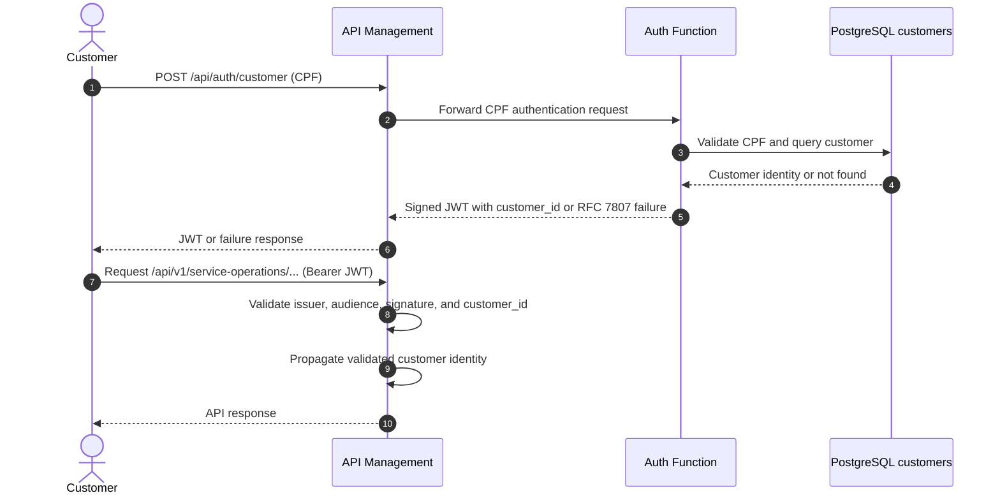
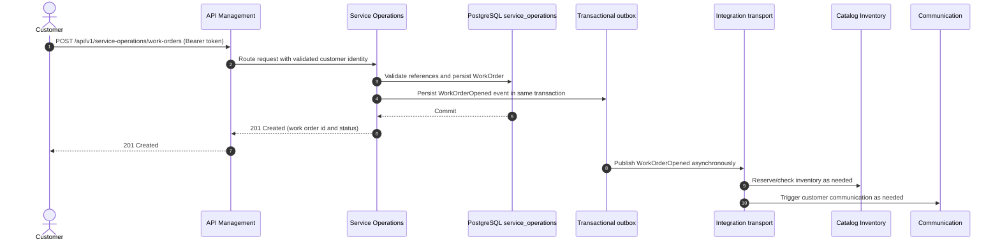

# Customer Authentication and Service Operations Sequences

## Customer authentication via CPF

The gateway is the public policy boundary. The serverless Auth Function validates the customer's CPF against PostgreSQL and issues a short-lived JWT containing `customer_id`. APIM validates the token using the configured signing key and propagates the validated identity to the AKS API. No password or signing key is placed in source control.

## Work order opening

Opening a work order is synchronous only through the Service Operations transaction. The API returns after the work order and its outbox message commit atomically. Downstream bounded contexts consume the integration event asynchronously, apply idempotent handling, and do not read or write the `service_operations` schema directly. A failed downstream action is retried or compensated by its own consumer rather than rolling back the committed operation.
