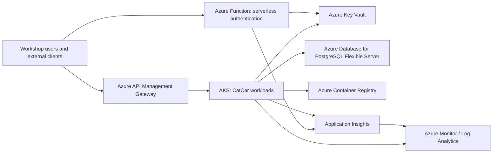

# Cloud Components

## Deployment topology

## Component responsibilities

| Component | Responsibility | Security boundary |
|---|---|---|
| Azure API Management (APIM) | Single public API gateway, authentication enforcement, request shaping, rate limits, and backend routing. | Public ingress; only APIM exposes the application API. |
| Azure Function | Independently deployable serverless authentication endpoint that validates credentials and issues authentication responses. | Retrieves secrets through managed identity; it never embeds secret material. |
| AKS | Hosts the CatCar API and background consumers. Workloads use workload identity and autoscale independently from the gateway. | Private workload subnet; RBAC, Azure Policy, and non-admin cluster access are enabled. |
| PostgreSQL Flexible Server | Managed relational persistence for CatCar schemas. | Private DNS and delegated subnet; public access is disabled. |
| Azure Monitor and Application Insights | Collect traces, metrics, logs, availability tests, dashboards, and alerts. | Observability data is retained in the workspace and controlled by Azure RBAC. |
| Key Vault | Holds connection strings and runtime secrets. | RBAC authorization and private network access; workloads use identity-based retrieval. |
| Azure Container Registry (ACR) | Stores versioned workload images consumed by AKS. | Premium registry with public access disabled; AKS kubelet identity has only `AcrPull`. |

## Network and deployment flow

`catcar-kubernetes-infra` owns the resource group, VNet, AKS, ACR, APIM, Log Analytics workspace, and Application Insights. `catcar-database-infra` consumes the VNet and resource group names as an explicit contract, then owns the delegated PostgreSQL subnet, private DNS zone, PostgreSQL server, and Key Vault. This state separation prevents a database deployment from changing cluster or gateway resources.

Build pipelines publish immutable images to ACR. AKS pulls those images with its kubelet managed identity. APIM routes requests to AKS backends; the Function supports the authentication boundary. Both compute paths emit telemetry to Application Insights, which is backed by Log Analytics for queries, workbooks, and alerts.
