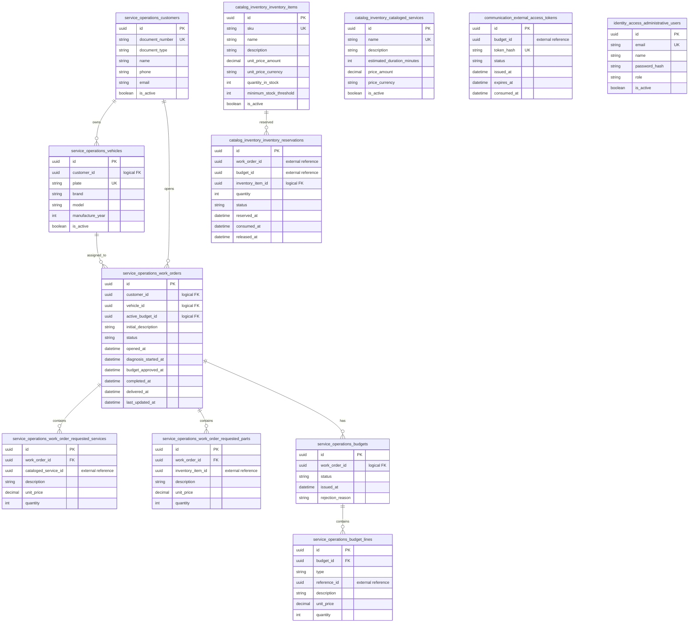

# Entity-Relationship Model

Each bounded context owns one EF Core `DbContext` and one PostgreSQL schema. Names below use the physical snake_case names produced by the naming convention. Audit fields (`created_at`, `updated_at`, `created_by`, `updated_by`) and PostgreSQL `xmin` concurrency token are present on aggregate tables unless stated otherwise.

## Schema ownership and constraints

| Schema | Tables | Key constraints and relationships |
|---|---|---|
| `service_operations` | `customers`, `vehicles`, `work_orders`, `work_order_requested_services`, `work_order_requested_parts`, `budgets`, `budget_lines` | `customers.document_number`, `vehicles.plate` are unique. `vehicles.customer_id`, `work_orders.customer_id`, `work_orders.vehicle_id`, and `budgets.work_order_id` express relations within the context. The owned line-item tables have physical FKs to their aggregate owner. |
| `catalog_inventory` | `cataloged_services`, `inventory_items`, `inventory_reservations` | `cataloged_services.name` and `inventory_items.sku` are unique. A reservation has a unique composite `(budget_id, inventory_item_id)` and references the local inventory item. |
| `communication` | `external_access_tokens` | `token_hash` is unique. `budget_id` is an external identity received from Service Operations, not a cross-schema FK. |
| `identity_access` | `administrative_users` | `email` is unique. Role is stored as a string-backed domain enum. |

## Cross-context relationship rule

The diagram distinguishes a physical/local FK from an external or logical reference. `cataloged_service_id`, `inventory_item_id`, `work_order_id`, and `budget_id` that cross a schema boundary are identifiers only. Their correctness is established through integration contracts and local snapshots, never through cross-schema foreign keys or direct database access.
