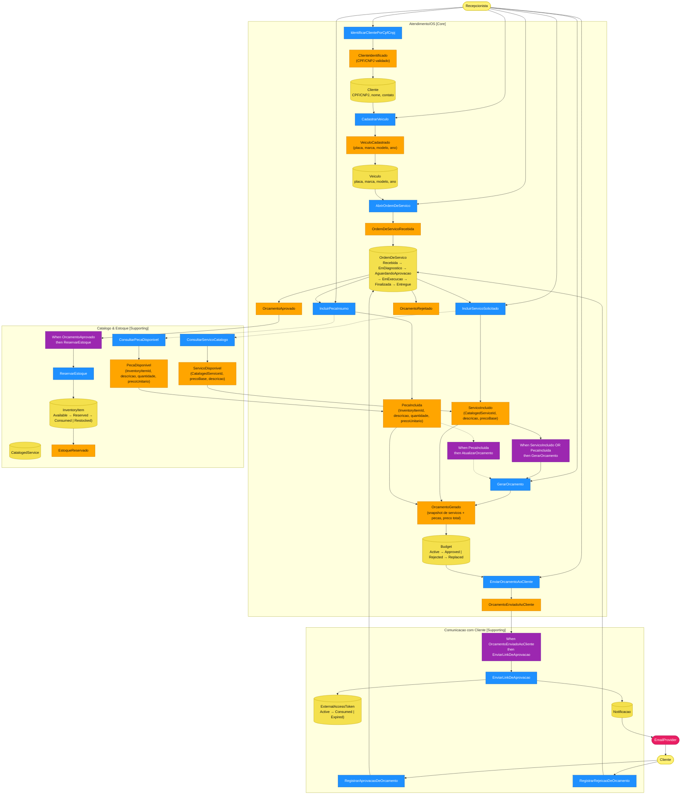

# Event Storming — design-estrategico-fases-1-2

## Work Order Creation Flow (AC-001)

Covers: customer identification by CPF/CNPJ · vehicle registration (plate, make, model, year) · service item inclusion · parts/supplies inclusion · automatic budget generation · budget submission to customer for approval.

## Work Order Tracking Flow (AC-002)

Covers: all six status transitions (Recebida → Em diagnóstico → Aguardando aprovação → Em execução → Finalizada → Entregue) · commands and events that trigger each transition · automatic status changes driven by system policies · customer query capability via API for progress tracking.

```mermaid
flowchart TB

  technician([Técnico]):::actor
  customer([Cliente]):::actor
  system([Sistema / Policy]):::external

  subgraph ATS["Atendimento/OS [Core]"]
    direction TB

    %% ── Transition 1: Received ──────────────────────────────
    iniciarDiagnostico["IniciarDiagnostico"]:::command
    diagnosticoIniciado["DiagnosticoIniciado"]:::event
    OS_Recebida[("OrdemDeServico<br/>Recebida")]:::aggregate

    %% ── Transition 2: In Diagnosis ─────────────────────────
    concluirDiagnostico["ConcluirDiagnostico"]:::command
    orcamentoEmitido["OrcamentoEmitido"]:::event
    OS_EmDiagnostico[("OrdemDeServico<br/>EmDiagnostico")]:::aggregate
    Budget_Active[("Budget<br/>Active")]:::aggregate

    %% ── Transition 3: Awaiting Approval ────────────────────
    policyEnvioLink["When OrcamentoEmitido<br/>then EnviarLinkDeAprovacao"]:::policy
    enviarLink["EnviarLinkDeAprovacao"]:::command
    linkEnviado["LinkDeAprovacaoEnviado"]:::event
    OS_AguardandoAprovacao[("OrdemDeServico<br/>AguardandoAprovacao")]:::aggregate
    ExternalAccessToken[("ExternalAccessToken<br/>Active → Consumed | Expired)")]:::aggregate

    %% ── Transition 4a: Approved → In Execution ─────────────
    registrarAprovacao["RegistrarAprovacaoDeOrcamento"]:::command
    orcamentoAprovado["OrcamentoAprovado"]:::event
    execucaoIniciada["ExecucaoIniciada"]:::event
    OS_EmExecucao[("OrdemDeServico<br/>EmExecucao")]:::aggregate

    %% ── Transition 4b: Rejected (terminal for this budget, triggers new budget cycle) ──
    registrarRejeicao["RegistrarRejeicaoDeOrcamento"]:::command
    orcamentoRejeitado["OrcamentoRejeitado"]:::event

    %% ── Transition 5: Completed ─────────────────────────────
    concluirServico["ConcluirServico"]:::command
    servicoConcluido["ServicoConcluido"]:::event
    OS_Finalizada[("OrdemDeServico<br/>Finalizada")]:::aggregate

    %% ── Transition 6: Delivered ─────────────────────────────
    entregarOS["EntregarOrdemDeServico"]:::command
    OS_Entregue[("OrdemDeServico<br/>Entregue")]:::aggregate

    %% ── Automatic transitions via system policies ───────────
    policyIniciarExecucao["When OrcamentoAprovado<br/>then IniciarExecucaoAutomaticamente"]:::policy
    policyFinalizar["When ServicoConcluido<br/>then FinalizarOSAutomaticamente"]:::policy
    policyEntregar["When OS_Finalizada<br/>then NotificarClienteParaRetirada"]:::policy

    %% ── Customer query capability ───────────────────────────
    consultarProgresso["ConsultarProgressoOS"]:::command
    progressoConsultado["ProgressoOSConsultado<br/>(status atual, histórico, orçamento)"]:::event
    OSQueryResult[("ResultadoConsultaOS<br/>REST API response")]:::aggregate
  end

  subgraph CES["Catalogo & Estoque [Supporting]"]
    direction TB
    policyReservar["When OrcamentoAprovado<br/>then ReservarEstoque"]:::policy
    reservarEstoque["ReservarEstoque"]:::command
    estoqueReservado["EstoqueReservado"]:::event
    inventoryItem[("InventoryItem<br/>Available → Reserved → Consumed)")]:::aggregate

    policyConsumir["When ServicoConcluido<br/>then ConsumirEstoqueReservado"]:::policy
    consumirEstoque["ConsumirEstoque"]:::command
    estoqueConsumido["EstoqueConsumido"]:::event
  end

  subgraph CEC["Comunicacao com Cliente [Supporting]"]
    direction TB
    notificarProgresso["NotificarProgressoAoCliente"]:::command
    emailProvider([EmailProvider]):::external
    SMSGateway([SMSGateway]):::external
  end

  %% ── Transition 1 actor trigger ─────────────────────────
  technician --> iniciarDiagnostico
  iniciarDiagnostico --> diagnosticoIniciado
  diagnosticoIniciado --> OS_Recebida

  %% ── Transition 2 ─────────────────────────────────────────
  technician --> concluirDiagnostico
  concluirDiagnostico --> orcamentoEmitido
  orcamentoEmitido --> OS_EmDiagnostico
  orcamentoEmitido --> Budget_Active

  %% ── Transition 3 automatic ─────────────────────────────
  orcamentoEmitido --> policyEnvioLink
  policyEnvioLink --> enviarLink
  enviarLink --> linkEnviado
  linkEnviado --> OS_AguardandoAprovacao
  linkEnviado --> ExternalAccessToken

  %% ── Transition 4a: approved → in execution ─────────────
  customer --> registrarAprovacao
  registrarAprovacao --> orcamentoAprovado
  orcamentoAprovado --> execucaoIniciada
  execucaoIniciada --> OS_EmExecucao

  %% Automatic execution start policy
  orcamentoAprovado --> policyIniciarExecucao
  policyIniciarExecucao -.-> execucaoIniciada

  %% ── Transition 4b: rejected ─────────────────────────────
  customer --> registrarRejeicao
  registrarRejeicao --> orcamentoRejeitado

  %% ── Transition 5 ─────────────────────────────────────────
  technician --> concluirServico
  concluirServico --> servicoConcluido
  servicoConcluido --> OS_Finalizada

  %% Automatic finalization policy
  servicoConcluido --> policyFinalizar
  policyFinalizar -.-> OS_Finalizada

  %% Automatic stock consumption
  servicoConcluido --> policyConsumir
  policyConsumir --> consumirEstoque
  consumirEstoque --> estoqueConsumido

  %% ── Transition 6 ─────────────────────────────────────────
  technician --> entregarOS
  entregarOS --> OS_Entregue

  %% Delivery notification policy
  OS_Finalizada --> policyEntregar
  policyEntregar --> notificarProgresso
  notificarProgresso --> emailProvider
  notificarProgresso --> SMSGateway

  %% ── Inventory reservation ────────────────────────────────
  orcamentoAprovado --> policyReservar
  policyReservar --> reservarEstoque
  reservarEstoque --> estoqueReservado
  estoqueReservado --> inventoryItem

  %% ── Customer query flow ───────────────────────────────────
  customer --> consultarProgresso
  consultarProgresso --> OSQueryResult
  OSQueryResult --> progressoConsultado

  classDef event fill:#FFA500,stroke:#C77800,color:#111;
  classDef command fill:#1E90FF,stroke:#1565C0,color:#fff;
  classDef aggregate fill:#F4E04D,stroke:#B59B00,color:#111;
  classDef policy fill:#9C27B0,stroke:#6A1B9A,color:#fff;
  classDef external fill:#E91E63,stroke:#C2185B,color:#fff;
  classDef actor fill:#FFF176,stroke:#C9B600,color:#111;
```

### Transition Summary Table

| # | From Status | To Status | Trigger (Command) | Triggering Event | Automatic Policy |
|---|---|---|---|---|---|
| T1 | *(start)* | `Recebida` | `IniciarDiagnostico` | `DiagnosticoIniciado` | — |
| T2 | `Recebida` | `EmDiagnostico` | `ConcluirDiagnostico` | `OrcamentoEmitido` | — |
| T3 | `EmDiagnostico` | `AguardandoAprovacao` | *(automatic via policy)* | `OrcamentoEmitido` | `When OrcamentoEmitido then EnviarLinkDeAprovacao` |
| T4a | `AguardandoAprovacao` | `EmExecucao` | `RegistrarAprovacaoDeOrcamento` | `OrcamentoAprovado` | `When OrcamentoAprovado then IniciarExecucaoAutomaticamente` |
| T4b | `AguardandoAprovacao` | *(rejected budget — new cycle)* | `RegistrarRejeicaoDeOrcamento` | `OrcamentoRejeitado` | — |
| T5 | `EmExecucao` | `Finalizada` | `ConcluirServico` | `ServicoConcluido` | `When ServicoConcluido then FinalizarOSAutomaticamente` |
| T6 | `Finalizada` | `Entregue` | `EntregarOrdemDeServico` | *(delivery confirmed)* | `When OS_Finalizada then NotificarClienteParaRetirada` |

### Customer Query Capability (API)

The customer can poll the current work order status **without authentication** (token-based):

- **Command:** `ConsultarProgressoOS`
- **Input:** `ExternalAccessToken` or `WorkOrderId + CPF/CNPJ`
- **Output event:** `ProgressoOSConsultado` containing:
  - Current status (Recebida / EmDiagnostico / AguardandoAprovacao / EmExecucao / Finalizada / Entregue)
  - Status history with timestamps
  - Active budget summary (services + parts + total price)
  - Estimated completion (if available)
- **API endpoint:** `GET /api/workorders/{workOrderId}/progress` (public, token or CPF verification)
- **BC ownership:** `Atendimento/OS` owns the read model; `Comunicacao com Cliente` does not expose internal OS state directly.

## Parts & Supplies Management Flow (AC-003)

Covers: CRUD for cataloged services · CRUD for parts/supplies · stock control operations (availability check, reservation, consumption, restocking).

```mermaid
flowchart TB

  admin([Administrador do Sistema]):::actor
  system([Sistema / Policy]):::external

  subgraph CES["Catalogo & Estoque [Supporting]"]
    direction TB

    %% ── CatalogedService CRUD ─────────────────────────────────
    cadastrarServico["CadastrarServicoCatalogo"]:::command
    servicoCatalogoCadastrado["ServicoCatalogoCadastrado<br/>(CatalogedServiceId, descricao, categoria, precoBase)"]:::event
    catalogedService[("CatalogedService<br/>descricao, categoria, precoBase")]:::aggregate

    atualizarServico["AtualizarServicoCatalogo"]:::command
    servicoCatalogoAtualizado["ServicoCatalogoAtualizado"]:::event

    inativarServico["InativarServicoCatalogo"]:::command
    servicoCatalogoInativado["ServicoCatalogoInativado"]:::event

    consultarServicoCatalogo["ConsultarServicoCatalogo"]:::command
    servicoCatalogoDisponivel["ServicoCatalogoDisponivel<br/>(CatalogedServiceId, precoBase, descricao)"]:::event

    %% ── InventoryItem CRUD ──────────────────────────────────
    cadastrarPeca["CadastrarPecaInsumo"]:::command
    pecaInsumoCadastrada["PecaInsumoCadastrada<br/>(InventoryItemId, descricao, unidade, precoUnitario)"]:::event
    inventoryItem[("InventoryItem<br/>Available → Reserved → Consumed | Restocked)")]:::aggregate

    atualizarPeca["AtualizarPecaInsumo"]:::command
    pecaInsumoAtualizada["PecaInsumoAtualizada"]:::event

    inativarPeca["InativarPecaInsumo"]:::command
    pecaInsumoInativada["PecaInsumoInativada"]:::event

    consultarPecaDisponivel["ConsultarPecaDisponivel"]:::command
    pecaDisponivel["PecaDisponivel<br/>(InventoryItemId, descricao, quantidade, precoUnitario)"]:::event

    %% ── Stock control operations ────────────────────────────
    verificarDisponibilidade["VerificarDisponibilidadeEstoque"]:::command
    disponibilidadeVerificada["DisponibilidadeVerificada<br/>(quantidadeDisponivel, reservado, disponivelReal)"]:::event

    policyReservar["When DisponibilidadeVerificada<br/>AND quantidadeSuficiente<br/>then ReservarEstoque"]:::policy
    reservarEstoque["ReservarEstoque"]:::command
    estoqueReservado["EstoqueReservado<br/>(workOrderId, quantidadeReservada)"]:::event

    policyLiberar["When OrcamentoRejeitado OR BudgetReplaced<br/>then LiberarReservaEstoque"]:::policy
    liberarReserva["LiberarReservaEstoque"]:::command
    reservaLiberada["ReservaLiberada<br/>(quantidadeLiberada)"]:::event

    policyConsumir["When ServicoConcluido<br/>then ConsumirEstoqueReservado"]:::policy
    consumirEstoque["ConsumirEstoque"]:::command
    estoqueConsumido["EstoqueConsumido<br/>(workOrderId, quantidadeConsumida)"]:::event

    policyRepor["When Administrador aciona ReporEstoque<br/>then ReporEstoque"]:::policy
    reporEstoque["ReporEstoque"]:::command
    estoqueReposto["EstoqueReposto<br/>(quantidadeAdicionada, motivo)"]:::event

    %% ── Aggregate state changes ────────────────────────────
    stateDisponivel["(Available)"]:::aggregate
    stateReservado["(Reserved)"]:::aggregate
    stateConsumido["(Consumed)"]:::aggregate
    stateReposto["(Restocked)"]:::aggregate
  end

  subgraph ATS["Atendimento/OS [Core]"]
    direction TB
    orcamentoAprovado["OrcamentoAprovado"]:::event
    orcamentoRejeitado["OrcamentoRejeitado"]:::event
    servicoConcluido["ServicoConcluido"]:::event
  end

  %% ── Admin CRUD triggers ─────────────────────────────────
  admin --> cadastrarServico
  cadastrarServico --> servicoCatalogoCadastrado
  servicoCatalogoCadastrado --> catalogedService

  admin --> atualizarServico
  atualizarServico --> servicoCatalogoAtualizado

  admin --> inativarServico
  inativarServico --> servicoCatalogoInativado

  admin --> cadastrarPeca
  cadastrarPeca --> pecaInsumoCadastrada
  pecaInsumoCadastrada --> inventoryItem

  admin --> atualizarPeca
  atualizarPeca --> pecaInsumoAtualizada

  admin --> inativarPeca
  inativarPeca --> pecaInsumoInativada

  admin --> reporEstoque

  %% ── Catalog queries ────────────────────────────────────────
  admin --> consultarServicoCatalogo
  consultarServicoCatalogo --> servicoCatalogoDisponivel

  admin --> consultarPecaDisponivel
  consultarPecaDisponivel --> pecaDisponivel

  %% ── Stock control flow ───────────────────────────────────
  verificarDisponibilidade --> disponibilidadeVerificada

  disponibilidadeVerificada --> policyReservar
  policyReservar --> reservarEstoque
  reservarEstoque --> estoqueReservado
  estoqueReservado --> stateReservado

  orcamentoRejeitado --> policyLiberar
  policyLiberar --> liberarReserva
  liberarReserva --> reservaLiberada
  reservaLiberada --> stateDisponivel

  servicoConcluido --> policyConsumir
  policyConsumir --> consumirEstoque
  consumirEstoque --> estoqueConsumido
  estoqueConsumido --> stateConsumido

  reporEstoque --> policyRepor
  policyRepor --> estoqueReposto
  estoqueReposto --> stateReposto

  %% ── State transitions ─────────────────────────────────────
  inventoryItem --> stateDisponivel
  stateDisponivel -.-> stateReservado
  stateReservado -.-> stateConsumido
  stateReservado -.-> stateDisponivel
  stateConsumido -.-> stateReposto

  classDef event fill:#FFA500,stroke:#C77800,color:#111;
  classDef command fill:#1E90FF,stroke:#1565C0,color:#fff;
  classDef aggregate fill:#F4E04D,stroke:#B59B00,color:#111;
  classDef policy fill:#9C27B0,stroke:#6A1B9A,color:#fff;
  classDef external fill:#E91E63,stroke:#C2185B,color:#fff;
  classDef actor fill:#FFF176,stroke:#C9B600,color:#111;
```

### CRUD Operations Detail

#### CatalogedService (Serviço Catalogado)
| Operation | Command | Event | Notes |
|---|---|---|---|
| Create | `CadastrarServicoCatalogo` | `ServicoCatalogoCadastrado` | Admin provides description, category, base price |
| Read | `ConsultarServicoCatalogo` | `ServicoCatalogoDisponivel` | Used by Atendimento when building budget |
| Update | `AtualizarServicoCatalogo` | `ServicoCatalogoAtualizado` | Does not affect WorkOrder budgets in progress (snapshot rule) |
| Delete (soft) | `InativarServicoCatalogo` | `ServicoCatalogoInativado` | Soft-delete; existing OS budgets are unaffected |

#### InventoryItem (Peça / Insumo)
| Operation | Command | Event | Notes |
|---|---|---|---|
| Create | `CadastrarPecaInsumo` | `PecaInsumoCadastrada` | Admin provides description, unit, unit price |
| Read | `ConsultarPecaDisponivel` | `PecaDisponivel` | Returns available quantity and unit price |
| Update | `AtualizarPecaInsumo` | `PecaInsumoAtualizada` | Does not affect WorkOrder budgets in progress |
| Delete (soft) | `InativarPecaInsumo` | `PecaInsumoInativada` | Soft-delete |

### Stock Control Operations Detail

| Operation | Command | Event | Pre-condition | Post-condition |
|---|---|---|---|---|
| Availability check | `VerificarDisponibilidadeEstoque` | `DisponibilidadeVerificada` | `InventoryItemId` exists | Returns available quantity, reserved quantity, net available |
| Reservation | `ReservarEstoque` | `EstoqueReservado` | `quantidade ≤ netAvailable` | Status → `Reserved`; linked to `WorkOrderId` |
| Release | `LiberarReservaEstoque` | `ReservaLiberada` | Active reservation exists for `WorkOrderId` | Status → `Available`; released quantity restored |
| Consumption | `ConsumirEstoque` | `EstoqueConsumido` | Active reservation for `WorkOrderId`; `quantidade ≤ reserved` | Decrement inventory; status → `Consumed` |
| Restocking | `ReporEstoque` | `EstoqueReposto` | Always allowed | Increment inventory; status → `Available`; reason recorded |

**Integrations with other BCs:**
- `OrcamentoAprovado` (from `Atendimento/OS`) triggers `ReservarEstoque` via policy
- `ServicoConcluido` (from `Atendimento/OS`) triggers `ConsumirEstoqueReservado` via policy
- `OrcamentoRejeitado` (from `Atendimento/OS`) triggers `LiberarReservaEstoque` via policy

## Notation Legend

| Symbol | Type | Description |
|--------|------|-------------|
| `([Actor])` | Actor | Human who triggers commands |
| `("Aggregate")` | Aggregate | Entity with lifecycle and invariants |
| `[Command]` | Command | Intent / action requested |
| `("Event")` | Event | Something that happened (past tense) |
| `{"Policy"}` | Policy | Reactive rule: when X then Y |
| `([External])` | External System | Outside the domain (e.g. EmailProvider) |
| `-.->` | Query / read | Read-model query (dashed arrow) |

## Source

This file mirrors `.kb/features/design-estrategico-fases-1-2/event-storming.md`.  
The editable Excalidraw source is at [event-storming.excalidraw](event-storming.excalidraw).