# CatCar solution module structure

```mermaid
flowchart TB
  root["CatCar.slnx"]

  subgraph srcGroup["src/"]
    direction TB
    srcRoot["src/"]

    subgraph contextsGroup["Contexts/"]
      direction TB
      contextsRoot["Contexts/"]

      subgraph atendimentoGroup["Atendimento/ [Core]"]
        direction TB
        atendimento["Atendimento/"]
        atendimentoDomain["Domain/"]
        atendimentoFeatures["Features/ (Vertical Slices)"]
        atendimentoInfra["Infrastructure/"]
        atendimentoIntegrations["Integrations/ (ACLs)"]
        atendimento --> atendimentoDomain
        atendimento --> atendimentoFeatures
        atendimento --> atendimentoInfra
        atendimento --> atendimentoIntegrations
      end

      subgraph catalogoGroup["CatalogoEstoque/ [Supporting]"]
        direction TB
        catalogo["CatalogoEstoque/"]
        catalogoDomain["Domain/"]
        catalogoFeatures["Features/"]
        catalogoInfra["Infrastructure/"]
        catalogo --> catalogoDomain
        catalogo --> catalogoFeatures
        catalogo --> catalogoInfra
      end

      subgraph comunicacaoGroup["Comunicacao/ [Supporting]"]
        direction TB
        comunicacao["Comunicacao/"]
        comunicacaoDomain["Domain/"]
        comunicacaoFeatures["Features/"]
        comunicacaoInfra["Infrastructure/"]
        comunicacao --> comunicacaoDomain
        comunicacao --> comunicacaoFeatures
        comunicacao --> comunicacaoInfra
      end

      subgraph identidadeGroup["Identidade/ [Generic]"]
        direction TB
        identidade["Identidade/"]
        identidadeDomain["Domain/"]
        identidadeFeatures["Features/"]
        identidadeInfra["Infrastructure/"]
        identidade --> identidadeDomain
        identidade --> identidadeFeatures
        identidade --> identidadeInfra
      end

      contextsRoot --> atendimento
      contextsRoot --> catalogo
      contextsRoot --> comunicacao
      contextsRoot --> identidade
    end

    sharedKernel["SharedKernel/ (base classes)"]
    contracts["Contracts/ (published language events)"]
    host["Host/ (Aspire AppHost)"]
    api["Api/ (Minimal APIs)"]

    srcRoot --> contextsRoot
    srcRoot --> sharedKernel
    srcRoot --> contracts
    srcRoot --> host
    srcRoot --> api
  end

  subgraph testsGroup["tests/"]
    direction TB
    testsRoot["tests/"]
    contextsTests["Contexts/<BC>.Tests/"]
    archTests["Architecture.Tests/"]
    e2e["E2E/"]
    testsRoot --> contextsTests
    testsRoot --> archTests
    testsRoot --> e2e
  end

  root --> srcRoot
  root --> testsRoot

  classDef root fill:#fff3bf,stroke:#f08c00,stroke-width:2px,color:#111;
  classDef folder fill:#e7f5ff,stroke:#339af0,color:#111;
  classDef context fill:#f8f0fc,stroke:#ae3ec9,color:#111;
  classDef leaf fill:#f1f3f5,stroke:#868e96,color:#111;

  class root root;
  class srcRoot,contextsRoot,testsRoot folder;
  class atendimento,catalogo,comunicacao,identidade context;
  class sharedKernel,contracts,host,api,atendimentoDomain,atendimentoFeatures,atendimentoInfra,atendimentoIntegrations,catalogoDomain,catalogoFeatures,catalogoInfra,comunicacaoDomain,comunicacaoFeatures,comunicacaoInfra,identidadeDomain,identidadeFeatures,identidadeInfra,contextsTests,archTests,e2e leaf;
```

## Module Descriptions

| Module | Type | Description |
|---|---|---|
| `Atendimento/` | Core BC | WorkOrder, Customer, Vehicle, Budget aggregates |
| `CatalogoEstoque/` | Supporting BC | CatalogedService, InventoryItem, stock control |
| `Comunicacao/` | Supporting BC | ExternalAccessToken, Notification |
| `Identidade/` | Generic BC | AdministrativeUser, Role, JWT auth |
| `SharedKernel/` | Infrastructure | Tactical DDD base classes only (`Entity<TId>`, `ValueObject`, `IAggregateRoot`, `IDomainEvent`, `Result<T>`) |
| `Contracts/` | Published Language | Serializable domain event records |
| `Host/` | Application | Aspire AppHost, Composition Root |
| `Api/` | Interface | REST endpoints (Minimal APIs) |

## Source

This file mirrors `.kb/features/design-estrategico-fases-1-2/module-structure.md`.  
The editable Excalidraw source is at [module-structure.excalidraw](module-structure.excalidraw).