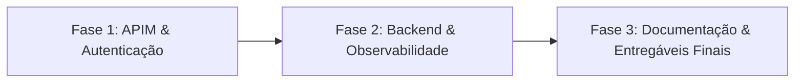

# Relatório de Auditoria Técnica e Conformidade — Fase 3 Tech Challenge

**Projeto:** CatCar Platform — Plataforma Integrada de Gestão de Oficina Mecânica  
**Documento Normativo de Referência:** [`docs/requirements/Fase_3_Tech_Challenge.md`](docs/requirements/Fase_3_Tech_Challenge.md)  
**Data da Auditoria:** Setembro de 2026  
**Escopo da Auditoria:** Meta-repositório umbrella (`catcar-platform`) e os 4 submódulos segregados:
1. `catcar-app` (Monolito Modular .NET 10, Wolverine Outbox, Aspire AppHost)
2. `catcar-auth-function` (Azure Function Serverless .NET 10 Isolated)
3. `catcar-database-infra` (Terraform IaC — PostgreSQL Flexible Server & Key Vault)
4. `catcar-kubernetes-infra` (Terraform IaC — AKS, ACR, APIM, VNet, Alertas & Workbooks)

---

## 1. Resumo Executivo & Diagnóstico Geral

A auditoria avaliou a conformidade da solução CatCar com as diretrizes obrigatórias da **Fase 3 do Tech Challenge**, cujo objetivo é elevar a aplicação ao nível de operação corporativa, empregando arquitetura de nuvem (Microsoft Azure), microsserviços/módulos segregados, computação serverless, observabilidade unificada e esteiras autônomas de CI/CD para múltiplos ambientes (**Homologação** e **Produção**).

### Tabela Síntese de Conformidade por Pilar

| Pilar do Desafio | Requisito Normativo | Status Atual | Diagnóstico Executivo |
|---|---|:---:|---|
| **1. Autenticação & API Gateway** | API Gateway na borda, autenticação via CPF por Function Serverless e proteção de rotas sensíveis via JWT. | **Parcialmente Conforme** | APIM e Function implementados e provisionados via Terraform. Identificado conflito de validação de claims JWT no APIM e métodos HTTP incompletos (apenas GET e POST mapeados). |
| **2. Estrutura de Repositórios & CI/CD** | 4 repositórios segregados com pipelines independentes, deploy automático para homologação (`develop`) e produção (`main`), e proteção de branches. | **Conforme** | Submódulos desacoplados, pipelines com OIDC Azure, compilação, testes, SAST, SCA, Trivy e deploy funcional. Script de bootstrap unificado e branch protection via API implementados. |
| **3. Infraestrutura Obrigatória** | API Gateway, Function Serverless, Banco Gerenciado, Cluster Kubernetes escalável e provisionamento 100% Terraform. | **Conforme** | Azure APIM, Azure Container Apps/Function v4, PostgreSQL 17 Flexible Server com DNS privado e AKS multi-zona com autoscaling provisionados via Terraform. |
| **4. Monitoramento & Observabilidade** | Azure Monitor/OTel, métricas de latência/CPU/memória/uptime, alertas de falhas de OS, logs estruturados e dashboards de negócio. | **Parcialmente Conforme** | Alertas e Log Analytics/Application Insights 100% codificados no Terraform. Contudo, o Dashboard KQL mede requisições HTTP em vez de ciclo de vida de OS, e a métrica C# omite o status de Finalização. |
| **5. Documentação Arquitetural** | Diagramas de Componentes e Sequência, RFCs (Nuvem, Banco, Auth), ADRs (Comunicação, HPA/APIM, Repos) e Modelo Relacional ER. | **Conforme** | Documentação rica em Mermaid cobrindo topologia, sequências de autenticação/OS, 3 RFCs formais, 3 ADRs decisórias e modelo ER completo com 12 entidades. |
| **6. Entregáveis do Tech Challenge** | 4 repositórios com READMEs e Dockerfiles, vídeo demonstrativo (até 15 min), PDF único e inclusão de `soat-architecture`. | **Parcialmente Conforme** | Código, Dockerfiles e pipelines entregues. Pendentes: gravação do vídeo demonstrativo, geração do PDF de submissão e inclusão formal do usuário institucional no GitHub. |

---

## 2. Matriz Detalhada: O Que Foi Implementado vs. O Que Falta

### 2.1 Autenticação e API Gateway
* **Requisitos:** API Gateway (APIM), autenticação via CPF, validação e consulta na base de dados, emissão de JWT, proteção de rotas sensíveis.
* **O que foi implementado:**
  * `catcar-kubernetes-infra/main.tf` (linhas 183–236): Provisionamento do Azure API Management (`apim-${local.name_prefix}`) e definição dos backends `catcar-api-aks` e `catcar-auth-function`.
  * `catcar-kubernetes-infra/apim-policy.xml` (linhas 1–52): Política global de inbound com validação de JWT (`<validate-jwt>`), rate-limiting de 5 req/min para autenticação e 60 req/min para clientes autenticados.
  * `catcar-auth-function/src/CatCar.AuthFunction/AuthenticateCustomerFunction.cs` (linhas 1–65): Function HTTP `POST /api/auth/customer` que valida o CPF (dígitos verificadores e formato) e consulta a existência do cliente ativo no banco via `ICustomerLookupService`.
  * `catcar-auth-function/src/CatCar.AuthFunction/CustomerLookupService.cs` (linhas 1–40): Consulta somente-leitura otimizada no schema `service_operations.customers`.
  * `catcar-auth-function/src/CatCar.AuthFunction/CustomerTokenIssuer.cs` (linhas 1–50): Emissão de token JWT assinado via HMAC-SHA256 com claims `sub` (Customer ID), `customer_id`, role `Customer`, issuer `CatCar` e audience `CatCar.Api`.
* **O que falta / Gaps:**
  * Mapeamento de verbos HTTP no APIM (`main.tf`): Apenas operações catch-all para `GET` e `POST` foram criadas. Verbos `PUT`, `PATCH` e `DELETE` retornam `404 Not Found` na borda.
  * Política do APIM restritiva: A regra `<otherwise>` do APIM exige `role=Customer` para qualquer rota que não seja login administrativo, conflitando com rotas que exigem perfil `Administrador` ou `Tecnico`.

---

### 2.2 Estrutura de Repositórios e CI/CD
* **Requisitos:** 4 repositórios segregados, pipelines de CI/CD autônomas, deploy contínuo em homologação (`develop`) e produção (`main`), regras de proteção de branch com PR obrigatório.
* **O que foi implementado:**
  * Segregação efetiva em 4 submódulos versionados no `.gitmodules` (linhas 1–12): `catcar-app`, `catcar-auth-function`, `catcar-database-infra`, `catcar-kubernetes-infra`.
  * Workflows independentes com autenticação OIDC passwordless (GitHub Actions <-> Microsoft Entra ID):
    * `catcar-app/.github/workflows/ci.yml` (624 linhas): Restauração, compilação, testes com OpenCover, Opengrep SAST, NuGet SCA, Trivy Container Scan, validação de modelo Aspire e deploy via Helm/Job no AKS.
    * `catcar-auth-function/.github/workflows/ci-cd.yml` (87 linhas): Build .NET 10, testes unitários, build/push de imagem ao ACR e deploy no Azure Container Apps.
    * `catcar-kubernetes-infra/.github/workflows/ci-cd.yml` (122 linhas): Validação Terraform (core e alertas) e apply automatizado com state no Azure Blob Storage.
    * `catcar-database-infra/.github/workflows/ci-cd.yml` (88 linhas): Validação Terraform e apply automatizado do PostgreSQL e Key Vault com state no Azure Blob Storage.
  * Automação de Governança: Script `scripts/bootstrap-azure.sh` atualizado com a função `ensure_branch_protection` que aplica via API REST do GitHub a proteção em `main` e `develop` (exigência de PR review, bloqueio de force push e exclusão).
* **O que falta / Gaps:**
  * Execução inicial do bootstrap contra a organização GitHub institucional (`RiseOn-CatCar`) para materializar os ambientes e branches remotas.

---

### 2.3 Infraestrutura Obrigatória (Cloud Azure & IaC)
* **Requisitos:** API Gateway, Function Serverless, Banco de Dados Gerenciado, Cluster Kubernetes escalável, provisionamento 100% via Terraform.
* **O que foi implementado:**
  * `catcar-kubernetes-infra/main.tf`:
    * VNet (`vnet-catcar-*`) com subnets dedicadas: `snet-aks` (/22), `snet-apim` (/24) e `snet-private-endpoints` (/24) (linhas 27–75).
    * Azure Kubernetes Service (`aks-${local.name_prefix}`): Versão 1.30+, Azure CNI, Workload Identity, Microsoft Entra RBAC, multi-zona (zonas 1, 2, 3), node pool com autoscaler (1 a 5 nós) (linhas 132–181).
    * Azure Container Registry (`cr${local.name_prefix}`): SKU Premium com RBAC `AcrPull` automatizado (linhas 77–108).
    * Azure API Management (`apim-${local.name_prefix}`): SKU Developer/Standard com políticas XML e backends mapeados (linhas 183–315).
  * `catcar-database-infra/main.tf`:
    * Azure Database for PostgreSQL Flexible Server v17 (`psql-${local.name_prefix}`): Subnet delegada (`snet-postgresql`), Private DNS Zone (`private.postgres.database.azure.com`), backup automatizado de 7 a 35 dias e SSL forçado (linhas 61–105).
    * Azure Key Vault (`kv-${local.name_prefix}`): Private Endpoint (`pe-kv-*`), Private DNS Zone (`privatelink.vaultcore.azure.net`), RBAC authorization e segredos `postgres-connection-string` e `postgres-auth-readonly-connection-string` (linhas 107–167).
  * `catcar-app/k8s/hpa.yaml`: Horizontal Pod Autoscaler baseado em CPU e Memória (limiar 70%, réplicas de 2 a 10).
* **O que falta / Gaps:**
  * O recurso de Workbook de monitoramento (`workbooks/catcar-dashboard.json`) não está instanciado no Terraform como recurso gerenciado (`azurerm_application_insights_workbook`).

---

### 2.4 Monitoramento e Observabilidade
* **Requisitos:** Integração com Azure Monitor/OTel, monitoramento de latência de API, CPU e memória do K8s, healthchecks e uptime, alertas para falhas de OS, logs estruturados em JSON com correlação e dashboards com métricas operacionais e de negócio.
* **O que foi implementado:**
  * `catcar-kubernetes-infra/alerts/catcar-alerts.tf`:
    * Alerta de Latência da API: `azurerm_monitor_metric_alert.high_latency` (linhas 137–157) — `requests/duration` > 2000 ms.
    * Alerta de CPU do AKS: `azurerm_monitor_metric_alert.high_cpu` (linhas 93–113) — `node_cpu_usage_percentage` > 80%.
    * Alerta de Memória do AKS: `azurerm_monitor_metric_alert.high_memory` (linhas 115–135) — `node_memory_working_set_percentage` > 85%.
    * Uptime & Health Check Sintético: `azurerm_application_insights_standard_web_test.uptime` (linhas 159–180) e `azurerm_monitor_metric_alert.uptime` (linhas 182–202) — probe externo a cada 300s com alarme em disponibilidade < 99%.
    * Alerta de Falhas de OS: `azurerm_monitor_scheduled_query_rules_alert_v2.os_processing_failures` (linhas 64–91) — monitora traces de erro em `AppTraces | where Message has 'WorkOrder' and SeverityLevel >= 3`.
  * `catcar-app/src/Api/Program.cs`:
    * Logs Estruturados: Serilog configurado com `CompactJsonFormatter` (linhas 20–23) e `UseSerilogRequestLogging()` (linha 92).
    * Health Checks da Aplicação: `/health/live` e `/health/ready` (com verificação real no PostgreSQL via `AddNpgSql`, linhas 54–56 e 131–132).
  * `catcar-app/src/Host/CatCar.ServiceDefaults/Extensions.cs` (linhas 47–97):
    * Instrumentação OpenTelemetry para ASP.NET Core, HttpClient e Runtime com exportação para Azure Monitor (`UseAzureMonitor()`) e OTLP (`UseOtlpExporter()`).
* **O que falta / Gaps:**
  * O dashboard de negócio no arquivo `catcar-kubernetes-infra/workbooks/catcar-dashboard.json` calcula volume e duração baseando-se em requisições HTTP da API e não no ciclo de vida das ordens de serviço.
  * O cálculo de tempo médio no backend (`WorkOrderRepository.cs:45–62`) calcula apenas Diagnóstico e Execução, omitindo a etapa de Finalização.
  * Ausência de enriquecimento explícito de `CorrelationId` nos logs do Serilog através de cabeçalhos HTTP (`X-Correlation-Id`).

---

### 2.5 Documentação da Arquitetura
* **Requisitos:** Diagrama de Componentes (nuvem, APIs, banco, monitoramento), Diagrama de Sequência (autenticação e abertura de OS), RFCs (Nuvem, Banco, Auth Serverless), ADRs (Padrão de Comunicação, HPA/APIM, Topologia de Repositórios), Modelo Relacional ER justificado.
* **O que foi implementado:**
  * Diagrama de Componentes: `docs/architecture/cloud-components.md` (linhas 5–18) e `README.md` raiz (linhas 87–157) em Mermaid.
  * Diagramas de Sequência: `docs/architecture/auth-sequence.md`:
    * Autenticação de Cliente via CPF: linhas 5–23.
    * Abertura de Ordem de Serviço com Outbox: linhas 29–51.
  * RFCs (Requests for Comments):
    * RFC 001: Escolha do Microsoft Azure (`docs/architecture/rfc/001-cloud-provider-selection.md`).
    * RFC 002: Escolha do PostgreSQL 17 Flexible Server (`docs/architecture/rfc/002-managed-database.md`).
    * RFC 003: Estratégia de Autenticação Serverless via Azure Functions (`docs/architecture/rfc/003-serverless-auth.md`).
  * ADRs (Architecture Decision Records):
    * ADR 001: Comunicação Assíncrona com Transactional Outbox e Wolverine (`docs/architecture/adr/001-asynchronous-communication-outbox.md`).
    * ADR 002: HPA no Kubernetes e Rate Limiting no APIM (`docs/architecture/adr/002-hpa-and-apim-scaling.md`).
    * ADR 003: Topologia em 4 Repositórios e Composição Aspire (`docs/architecture/adr/003-repository-topology.md`).
  * Modelo Relacional e Diagrama ER:
    * `docs/architecture/er-model.md` (linhas 5–129): Diagrama Mermaid cobrindo 12 tabelas em 4 schemas com tipos, PKs, UKs e relacionamentos lógicos inter-contextos.
* **O que falta / Gaps:**
  * Alinhar as roles exibidas no diagrama de abertura de OS com a implementação de segurança do endpoint `POST /api/v1/service-operations/work-orders`.

---

### 2.6 Entregáveis do Tech Challenge
* **Requisitos:** 4 repositórios Git públicos/privados com instruções claras no README, Dockerfiles, pipelines funcionais, vídeo demonstrativo (até 15 min), entrega no Portal do Aluno com PDF único e permissão ao usuário `soat-architecture`.
* **O que foi implementado:**
  * 4 submódulos estruturados e sincronizados com a branch `main`.
  * Dockerfiles funcionais multi-stage para a API (`catcar-app/Dockerfile`) e para a Function (`catcar-auth-function/Dockerfile`).
  * Pipelines de CI/CD completas em todos os 4 repositórios.
  * Requisitos do vídeo e da entrega no portal mapeados em `docs/requirements/Fase_3_Tech_Challenge.md` (linhas 108–125) e em `catcar-app/docs/status-requisitos-entregaveis.md`.
* **O que falta / Gaps:**
  * READMEs dos submódulos necessitam de diagramas arquiteturais dedicados e links diretos para a documentação Swagger/Postman.
  * Gravação do vídeo de demonstração (até 15 min).
  * Geração do PDF final de entrega para submissão no portal acadêmico.
  * Confirmação do aceite de convite do usuário `soat-architecture` como colaborador nos repositórios.

---

## 3. Gaps Críticos e Desalinhamentos Técnicos

Esta seção detalha os **7 gaps técnicos e conceituais** identificados na base de código que necessitam de intervenção corretiva para garantir integridade arquitetural e conformidade absoluta com o edital.

---

### GAP 1: Incompatibilidade entre a Política de JWT do APIM e a API Principal
* **Localização:** [`catcar-kubernetes-infra/apim-policy.xml`](catcar-kubernetes-infra/apim-policy.xml) (linhas 21–32) vs. [`catcar-app/src/Api/Program.cs`](catcar-app/src/Api/Program.cs).
* **Problema Concreto:**
  Na política de entrada do APIM, a seção `<otherwise>` (que intercepta qualquer rota que não seja `/api/auth/customer` ou `/api/v1/identity-access/auth/login`) aplica a validação:
  ```xml
  <validate-jwt header-name="Authorization" ...>
      <issuers><issuer>CatCar</issuer></issuers>
      <audiences><audience>CatCar.Api</audience></audiences>
      <required-claims>
          <claim name="role" match="any"><value>Customer</value></claim>
          <claim name="customer_id" />
      </required-claims>
  </validate-jwt>
  ```
  Se um usuário administrativo autenticado via backoffice tentar consumir rotas de catálogo, inventário ou operações através do gateway, sua requisição será **bloqueada com 401 Unauthorized no APIM** porque seu token JWT contém `role = Administrador` (ou `Tecnico`) e não possui a claim `customer_id`.
* **Impacto:** Bloqueio total das rotas administrativas e operacionais através do API Gateway.
* **Solução Necessária:** Flexibilizar a política do APIM para aceitar tanto tokens de `Customer` (com `customer_id`) quanto tokens de colaboradores (`role in ['Administrador', 'Tecnico', 'Atendente']`).

---

### GAP 2: Operações HTTP Incompletas no API Management (Falta PUT, PATCH, DELETE)
* **Localização:** [`catcar-kubernetes-infra/main.tf`](catcar-kubernetes-infra/main.tf) (linhas 238–307).
* **Problema Concreto:**
  O Terraform provisiona operações específicas para login/auth e define apenas duas operações catch-all:
  * `catcar_get_catch_all` (linhas 269–287, `method = "GET"`, `url_template = "{*path}"`)
  * `catcar_post_catch_all` (linhas 289–307, `method = "POST"`, `url_template = "{*path}"`)
  Não existem recursos para os métodos `PUT`, `PATCH` ou `DELETE`.
* **Impacto:** Qualquer chamada HTTP de atualização (`PUT /api/v1/...`), atualização parcial (`PATCH`) ou exclusão (`DELETE`) enviada para a URL do gateway receberá imediatamente `404 Resource Not Found` gerado pelo próprio APIM.
* **Solução Necessária:** Adicionar as operações catch-all para `PUT`, `PATCH` e `DELETE` no `main.tf` do APIM, apontando para o backend do AKS.

---

### GAP 3: Dashboard de Negócio Não Provisionado no Terraform e Queries KQL Incorretas
* **Localização:** [`catcar-kubernetes-infra/workbooks/catcar-dashboard.json`](catcar-kubernetes-infra/workbooks/catcar-dashboard.json) (linhas 16–49) e [`catcar-kubernetes-infra/main.tf`](catcar-kubernetes-infra/main.tf).
* **Problema Concreto:**
  1. O arquivo `catcar-dashboard.json` está estático no disco e **não é provisionado no Azure** por nenhuma declaração Terraform (ausência do recurso `azurerm_application_insights_workbook`).
  2. As consultas KQL implementadas no JSON analisam a tabela de telemetria HTTP (`requests`), medindo volume de chamadas web e latência em milissegundos, em vez de métricas de negócio do ciclo de vida da OS:
     * *Volume Diário de OS:* Conta todas as requisições HTTP cujo nome contém `work-orders`, inflando os dados com listagens, consultas de progresso e requisições repetidas.
     * *Tempo Médio por Status:* Calcula `avg(duration)` da chamada HTTP em milissegundos agrupado pelo nome do endpoint, em vez do tempo em que uma ordem de serviço permaneceu nos status de Diagnóstico, Execução e Finalização.
* **Impacto:** O dashboard não atende ao propósito analítico solicitado no Tech Challenge.
* **Solução Necessária:** Declarar o recurso `azurerm_application_insights_workbook` no Terraform referenciando o JSON e reformular as consultas KQL para rastrear eventos e logs estruturados de domínio (`AppTraces` / `customDimensions` de mudança de status da OS).

---

### GAP 4: Métrica de Tempo Médio no Backend C# sem Tempo de Finalização
* **Localização:** [`catcar-app/src/Contexts/ServiceOperations/Domain/WorkOrders/WorkOrderExecutionTimeMetrics.cs`](catcar-app/src/Contexts/ServiceOperations/Domain/WorkOrders/WorkOrderExecutionTimeMetrics.cs) (linhas 3–8) e [`catcar-app/src/Contexts/ServiceOperations/Infrastructure/Persistence/WorkOrderRepository.cs`](catcar-app/src/Contexts/ServiceOperations/Infrastructure/Persistence/WorkOrderRepository.cs) (linhas 45–62).
* **Problema Concreto:**
  O edital exige expressamente:
  > *"Tempo médio de execução por status (Diagnóstico, Execução, Finalização)."*
  O record de domínio e a agregação EF Core calculam apenas:
  ```csharp
  public sealed record WorkOrderExecutionTimeMetrics(
      int TotalCompletedWorkOrders,
      double AverageTotalExecutionTimeHours,
      double AverageDiagnosisTimeHours,
      double AverageExecutionTimeHours);
  ```
  A etapa de **Finalização** (tempo transcorrido entre a conclusão do serviço `CompletedAt` e a entrega efetiva do veículo `DeliveredAt`) foi completamente omitida da fórmula de agregação e do endpoint `/api/work-orders/metrics/average-execution-time`.
* **Impacto:** Não atendimento estrito de um sub-item obrigatório do edital.
* **Solução Necessária:** Adicionar o campo `AverageCompletionTimeHours` ao record `WorkOrderExecutionTimeMetrics`, ao endpoint DTO, e incluir no cálculo SQL do repositório:
  `group.Average(w => w.CompletedAt.HasValue && w.DeliveredAt.HasValue ? (double?)(w.DeliveredAt.Value - w.CompletedAt.Value).TotalHours : null) ?? 0`.

---

### GAP 5: Falta de Injeção de `CorrelationId` nos Logs Estruturados do Serilog
* **Localização:** [`catcar-app/src/Api/Program.cs`](catcar-app/src/Api/Program.cs) (linhas 20–23).
* **Problema Concreto:**
  A configuração atual do Serilog registra:
  ```csharp
  builder.Host.UseSerilog((ctx, cfg) =>
      cfg.ReadFrom.Configuration(ctx.Configuration)
         .Enrich.FromLogContext()
         .WriteTo.Console(new Serilog.Formatting.Compact.CompactJsonFormatter()));
  ```
  Embora o Serilog use `CompactJsonFormatter` e o ASP.NET Core possua um `TraceIdentifier` interno, **não há middleware na aplicação que capture o cabeçalho `X-Correlation-Id`** (enviado pelo APIM ou clientes externos) para empurrá-lo explicitamente no `LogContext` com a propriedade padronizada `CorrelationId`.
* **Impacto:** Dificuldade de correlacionar logs estruturados entre APIM, Azure Functions e API no Log Analytics Workspace utilizando uma chave unificada.
* **Solução Necessária:** Adicionar um middleware de Correlation ID no pipeline HTTP do `Program.cs` que leia/gere o `X-Correlation-Id`, insira no header da resposta e utilize `LogContext.PushProperty("CorrelationId", correlationId)`.

---

### GAP 6: Divergência entre o Diagrama de Sequência de Abertura de OS e as Roles Exigidas no Endpoint
* **Localização:** [`docs/architecture/auth-sequence.md`](docs/architecture/auth-sequence.md) (linhas 29–51) vs. [`catcar-app/src/Contexts/ServiceOperations/Features/WorkOrders/OpenWorkOrder/OpenWorkOrderEndpoint.cs`](catcar-app/src/Contexts/ServiceOperations/Features/WorkOrders/OpenWorkOrder/OpenWorkOrderEndpoint.cs) (linha 26).
* **Problema Concreto:**
  O diagrama de sequência documenta:
  ```mermaid
  Customer->>APIM: POST /api/v1/service-operations/work-orders (Bearer token)
  APIM->>OS: Route request with validated customer identity
  ```
  Sugerindo que o próprio cliente pode abrir a sua ordem de serviço após autenticar-se via CPF.
  Entretanto, a implementação do endpoint em C# exige estritamente:
  ```csharp
  .RequireAuthorization(policy => policy.RequireRole("Administrador", "Tecnico"))
  ```
  Rejeitando qualquer token de cliente com `403 Forbidden`.
* **Impacto:** Descompasso conceitual entre a documentação de arquitetura entregue e a segurança real do código.
* **Solução Necessária:** Decidir arquiteturalmente se clientes autenticados podem submeter ordens de serviço (adicionando a role `Customer` na política do endpoint) ou atualizar o diagrama de sequência para indicar que o ator de abertura é um `Attendant` / `Technician`.

---

### GAP 7: READMEs dos Submódulos sem Diagramas Dedicados e Links Diretos para Swagger/Postman
* **Localização:** `catcar-app/README.md`, `catcar-database-infra/README.md`, `catcar-kubernetes-infra/README.md`, `catcar-auth-function/README.md`.
* **Problema Concreto:**
  O edital normativo exige para o `README.md` de cada um dos repositórios:
  > * "Diagrama da arquitetura específica daquele repositório."
  > * "Link para o Swagger/Postman das APIs."
  Atualmente:
  * `catcar-app/README.md`: Contém apenas tabelas descritivas e árvore de arquivos; não possui diagrama Mermaid/ASCII dedicado da arquitetura de software modular. O link de API aponta para Scalar UI e OpenAPI JSON, sem link explícito para Swagger (`/swagger`) ou collection Postman.
  * `catcar-database-infra/README.md` e `catcar-kubernetes-infra/README.md`: Não contêm diagramas arquiteturais dedicados dos recursos provisionados por cada stack nem referências de Swagger/Postman.
  * `catcar-auth-function/README.md`: Possui diagrama ASCII, mas não referencia links de Swagger/Postman.
* **Impacto:** Apontamento de não-conformidade na avaliação formal dos entregáveis.
* **Solução Necessária:** Inserir diagramas Mermaid dedicados em cada README e disponibilizar uma collection Postman exportada versionada no repositório, com links explícitos em todos os READMEs.

---

## 4. Ações Já Realizadas (Etapa Preparatória)

Como parte das correções imediatas de governança e infraestrutura, foram implementadas as seguintes ações estruturantes:

1. **Atualização Completa do Script de Bootstrap (`scripts/bootstrap-azure.sh`):**
   * **Suporte Dual-Environment:** Introdução do parâmetro `--environment [homologation|production|all]` (ou `-e`), permitindo provisionar isoladamente ou conjuntamente os ambientes de **Homologação** (`develop`) e **Produção** (`main`).
   * **Multi-Repositório Nativo:** O script itera automaticamente sobre os 4 repositórios da organização (`catcar-app`, `catcar-auth-function`, `catcar-database-infra`, `catcar-kubernetes-infra`) e o meta-repo, provisionando variáveis e secrets em cada um.
   * **Workload Identity & OIDC Granular:** Configuração de aplicações dedicadas no Microsoft Entra ID com federated credentials apontando para as branches (`develop`, `main`), pull requests e environments (`homologation`, `production`).
   * **Branch Protection Automatizada:** Implementação da função `ensure_branch_protection` que configura via GitHub API REST as regras em `main` e `develop` (exigência de 1 aprovação em PR, descarte de revisões obsoletas, bloqueio de force-push e bloqueio de exclusão).
2. **Sincronização Absoluta entre Repositórios:**
   * O script `bootstrap-azure.sh` e o manual `docs/azure-bootstrap.md` foram sincronizados de forma idêntica (byte-a-byte) entre a raiz, `catcar-kubernetes-infra` e `catcar-app`.
3. **Validação de Sintaxe e Simulação:**
   * Executado `bash -n` em todos os scripts shell com 100% de aprovação.
   * Executado `./scripts/bootstrap-azure.sh --dry-run` demonstrando o plano completo de criação de contas de storage (`stcatcarhomolog...`, `stcatcarprod...`), resource groups isolados e injeção de segredos.

---

## 5. Roadmap de Execução para as Próximas Fases

Para sanar integralmente todos os gaps identificados e preparar a plataforma para nota máxima na entrega da Fase 3, estabelece-se o seguinte cronograma de ação técnica:



### Fase 1: Ajustes no API Management e Segurança
1. **Corrigir Operações do APIM no Terraform (`catcar-kubernetes-infra/main.tf`):**
   * Adicionar recursos `azurerm_api_management_api_operation` para os métodos `PUT`, `PATCH` e `DELETE` utilizando o template `{*path}` apontando para `catcar-api-aks`.
2. **Refatorar a Política do Gateway (`catcar-kubernetes-infra/apim-policy.xml`):**
   * Ajustar a validação JWT para aceitar tanto `role = Customer` quanto roles de colaboradores (`Administrador`, `Tecnico`).
   * Condicionar a validação da claim `customer_id` apenas quando a role for `Customer`.
3. **Alinhamento de Permissões de Abertura de OS (`OpenWorkOrderEndpoint.cs`):**
   * Permitir que a role `Customer` abra ordem de serviço para si próprio (validando se o `customerId` do comando bate com a claim `customer_id`), mantendo acesso livre para `Administrador` e `Tecnico`.

### Fase 2: Backend, Métricas e Dashboard Azure Monitor
1. **Enriquecimento de Correlation ID no Monolito (`catcar-app/src/Api/Program.cs`):**
   * Implementar middleware no ASP.NET Core que capture `X-Correlation-Id` do header HTTP (ou gere um novo UUID v7) e propague no `LogContext.PushProperty("CorrelationId", id)` do Serilog e nos headers de resposta.
2. **Completar Métrica de Tempo Médio de Execução (`ServiceOperations`):**
   * Atualizar `WorkOrderExecutionTimeMetrics.cs` para incluir `AverageCompletionTimeHours`.
   * Atualizar a consulta agregada em `WorkOrderRepository.cs` para calcular a diferença entre `DeliveredAt` e `CompletedAt`.
   * Atualizar o endpoint DTO e testes unitários.
3. **Provisionamento do Dashboard via Terraform (`catcar-kubernetes-infra`):**
   * Adicionar o recurso `azurerm_application_insights_workbook` no Terraform provisionando o dashboard nativo do Azure Monitor.
   * Corrigir as queries KQL em `catcar-dashboard.json` para analisar eventos reais de negócio e tempos de ciclo de vida da OS.

### Fase 3: Documentação, Vídeo e Submissão Final
1. **Enriquecimento dos READMEs dos 4 Submódulos:**
   * Desenhar diagramas Mermaid específicos para cada componente (fluxo interno do app, componentes da function serverless, topologia do banco e rede/K8s).
   * Adicionar link explícito para Swagger UI (`/swagger`) e exportar uma collection Postman versionada na raiz da documentação.
2. **Gravação do Vídeo Demonstrativo (até 15 minutos):**
   * Estruturar roteiro cobrindo: autenticação via CPF, execução das 4 pipelines de CI/CD, deploy automatizado, consumo de APIs protegidas, dashboard do Azure Monitor ao vivo e inspeção de traces distribuídos.
   * Publicar no YouTube/Vimeo como não listado e incluir URL nos READMEs.
3. **Geração do PDF de Entrega no Portal do Aluno:**
   * Gerar documento PDF consolidado contendo: identificação do grupo, links dos 4 repositórios, link do vídeo demonstrativo, links das documentações e comprovante de acesso do usuário `soat-architecture`.
